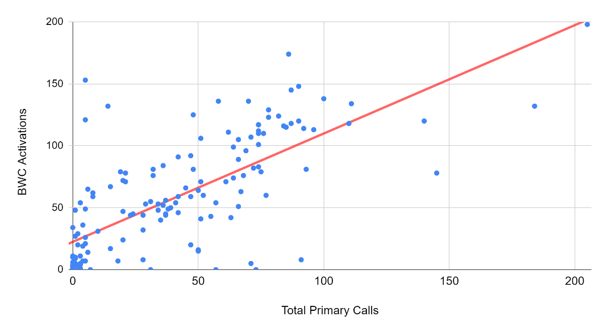
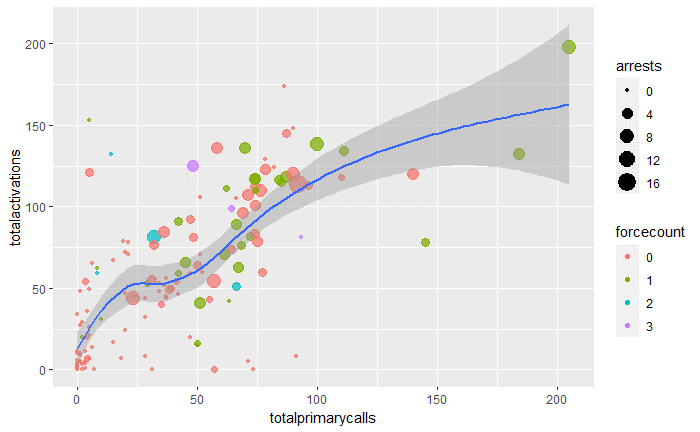

Forthcoming (2021), *Public Administration Review*

**Authors:**

> Ian T. Adams[^1] [ian.adams\@utah.edu](mailto:ian.adams@utah.edu) Department of Political Science, University of Utah
> [^2]
>
> Scott M. Mourtgos [scott.mourtgos\@utah.edu](mailto:scott.mourtgos@utah.edu) Department of Political Science, University of Utah[^3]
>
> Sharon H. Mastracci [sharon.mastracci\@poli-sci.utah.edu](mailto:sharon.mastracci@poli-sci.utah.edu) Department of Political Science, University of Utah[^4]

[^1]: Corresponding author: Ian Adams, University of Utah, ian.adams\@utah.edu

[^2]: Ian T. Adams (corresponding author) is a Ph.D. candidate in the Department of Political Science at the University of Utah. His research focuses on body-worn cameras, police officers, and emotional labor. Ian is a 2018 American Society of Public Administration Founders' Fellow, and a 2021 doctoral fellow of the Academy of Criminal Justice Sciences. More information on his research is available at [www.ianadamsresearch.com](www.ianadamsresearch.com).

[^3]: Scott Mourtgos is a Ph.D. student in the Department of Political Science at the University of Utah. His research focuses on policing and criminal justice policy. Scott is a 2020 National Institute of Justice LEADS Scholar. More information on his research is available at [\<https://smourtgos.netlify.app/\>](https://smourtgos.netlify.app/).

[^4]: Sharon Mastracci is a Professor of Political Science and the Director of the Programs of Public Affairs at the University of Utah.She studies gender in public organizations and emotional labor and dirty work in public service. She was a 2014-2015 Fulbright scholar to the United Kingdom and a 2020 Fellow of the National Academy of Public Administration.

## Evidence for Practice

-   Job functions best explain activations of police BWCs.
    Clear-cut agency policy, such as mandating recording all public contacts, arrests, and probable use-of-force, will increase BWC activation.

-   Officers with sharper levels of concern that BWC's reduce their professional discretion, or expose them to public hatred and outrage, are likely to activate the cameras less often.

-   To the extent possible, public safety administrators should adopt model policies on BWC activation and communicate their support for difficult discretionary decision-making by frontline officers.

-   Nearly two-thirds of officers activate their camera more often than predicted by the best performing model.
    This indicates that BWC policy effectively sets a "floor" of minimum activation standards and that overall, officers will record more often than required.

------------------------------------------------------------------------

# Introduction

> **Sergeant**: Which side do you want?
>
> **Officer**: Usually, the better-looking girls are on the other side.
>
> **Sergeant**: The church girls?
>
> **Officer**: Yeah, church girls are a little cleaner, at least.
>
> *\[pause\]*
>
> **Officer**: That's on that body cam already.
> I'm already in trouble.
> I've been here two minutes.
> Nice.

Body-worn cameras (BWCs) are a workplace surveillance technology, forming the new normal in US policing.
Increasingly adopted internationally, BWCs are now migrating to other public sector contexts, including medical services (Knapton and Walker 2017), public schools (Adams 2020), and public transit (Ariel et al. 2019).
This expansion of BWCs to other public sector contexts is an opportunity to synthesize the BWC literature with public administration scholarship on administrative discretion, to better prepare public managers for BWC implementation challenges.

The evidence so far is weighted towards some positive outcomes from BWC adoption (Lum et al. 2019; White and Malm 2020), but in some cases, the lack of effect has raised the question of whether officer discretion in activating the cameras is to blame. There is some evidence that citizens also distrust leaving the decision to activate a BWC in officers' hands (Bromberg, Charbonneau, and Smith 2018).

The Rialto Study (Ariel, Farrar, and Sutherland 2015) provided first-of-its-kind results indicating a substantial reduction in use-of-force and public complaints when police officers are equipped with BWCs.
The results from Rialto were found to persist well past the initial experimental period, though questions remain about the context of the department and whether there was something "special" about the agency (Sutherland et al. 2017; Gaub and White 2020) that led to large magnitude effects not often seen in other agencies' experience with BWCs.
For example, in 2007 the city council had voted to disband the Rialto Police Department in favor of contracting for police services with the San Bernardino Sheriff's Office (Kelly and Reston 2007). A new chief, Tony Farrar, was hired in 2011, and later was an author and primary investigator in the Rialto Study. These factors may point to a department at a "low point," and that the rapid decreases in use-of-force and complaints were at least partially attributable to sources other than BWCs (see Gaub and White 2020 for a broad discussion of agency context and BWCs).

Some US agencies had begun limited experimenting with BWCs before the Rialto study (Miller and Toliver 2014) for varied but consistent reasons, including improvements to officer safety, reduced civilian complaints, and reduced agency liability (Hyland 2018). The Rialto study's promising results were the subject of high media coverage (Schneider 2018) and highlighted in President Obama's 21st Century Policing report (President's Task Force, 2015), which recommended BWCs across US policing in order to enhance community trust in police. That recommendation was bolstered by federal funding to purchase BWCs for law enforcement agencies (Edwards 2015). Widespread implementation accelerated across the US beginning in 2015, and by 2018 an estimated 64% of large agencies were using BWCs (Nix, Todak, and Tregle 2020).

With wide BWC implementation came expectations of greater transparency and accountability for police actions (Lum et al. 2019; 2020). However, "BWCs will have a minimal deterrent effect when officers have broad discretion around activating their cameras" (Peterson and Lawrence 2019, 8). If officers deliberately fail to activate their BWCs to avoid their departments and communities' surveillant gaze, then bad behavior will not be deterred. If, however, officers are good stewards of their profession and follow department policies, then job function--the actual work of an officer, guided by agency policy, assignment, and oversight---and not individual characteristics of officers or their attitudes about BWCs will predict activations. This article tests competing explanations for the exercise of discretion in policing, a high-stakes context for administrative discretion.

## Review of the Literature: Administrative Discretion and Body-Worn Cameras

If the purpose of BWCs is to monitor officer behavior, why are cameras not always recording?
Or if cameras must be activated manually, why give the officer discretion over that decision?
Discretion in public decision-making is at once a threat to democracy (Aberbach and Rockman 1988; Finer 1941), a source of social and economic inequality (Cárdenas and Cruz 2017), and yet a fact of administrative life (Sowa and Selden 2003).
Imperfect oversight means that "responsible conduct of administrative functions is not so much enforced as it is *elicited*" (Friedrich 1940, 9).

Early evidence from a study in Phoenix, Arizona (Katz et al. 2015) found that within a discretionary policy framework, activation rates for BWCs was relatively low, at under 30% overall, and that activation rates declined over time to a low of 13.2% by the end of the study.
This evidence was supported by a one-year study in Mesa, Arizona (Young and Ready 2016), which compared two cohorts of BWC-equipped officers under a mandatory activation policy versus a discretionary policy.
When officers were allowed more discretion, activation rates fell by 27%, though this negative effect was more pronounced for officers who were mandated to wear the cameras compared to those who volunteered to do so.
Further, a multi-site study that included both US and European study sites found that BWCs increased assaults against officers (Ariel et al. 2016b).
The authors returned with further analysis showing that treatment fidelity had been compromised in the original study.
The secondary analysis (Ariel et al. 2017) theorized that unplanned, "strong" discretion in some study sites had backfired, leading to increased use-of-force, suggesting that BWC policies should seek some optimal deterrence point that allows for some officer discretion, but with a strong assumption for recording of most police-public interactions.

Officers receive training on BWCs and activation guidance (Gaub et al. 2020).
Agency policy determines when and what must and must not be recorded (White and Malm 2020), but in the field (Leys 1943; Simon 1944), it is up to the officer to decide whether to activate their BWC or not.
Procedural controls are only partially effective in curbing discretion (Spence 1999).
At the time of this writing, file storage costs prohibit municipalities from practicing an always-on BWC policy, and remote or automatic camera activation is not yet widespread.

Street-level bureaucrats in law enforcement possess the power to use lethal force in the discharge of their duties.
Better understanding what drives BWC activation in a discretionary environment can lead to improved training, policy, and auditing related to BWCs.
Understanding the forces competing for control of an officer's discretion is the first step in structuring theories of controlling that discretion (Mastrofski 2004), and can lead to improved training, policy, and auditing related to BWCs.

## BWC Activations as High-Stakes Administrative Discretion

Police work "entails a tension between the exercise of discretion by officers on the street and the control of that discretion by police organizations" (Engel and Worden 2003, 131).
Understanding officer discretion has been a long-standing concern of researchers (Davis 1975; Goldstein 1963).
Discretion is at the core of the professional police identity (Bayley 2011; Crank 2014), which itself is a primary component of officer performance and wellbeing (Schaible 2018).
Both Wilson (1968) and Bittner (1970) provide foundational explanations for understanding the necessity of police discretion.
Discretion is the necessary leeway granted to police because that is the only reasonable tool to effectively deal with the situational exigencies encountered by police (Bittner 1970).
Early exploration of a theory of street-level bureaucracy (Lipsky 1980) was built atop an attempt to understand police discretion in use-of-force, and how those decisions both imperil and produce justice (Lipsky 1973).
The first systematic study of police shootings (Fyfe 1979) found that officers' discretion could be constrained with policy changes, and Rohr (1989) saw administrative discretion as the critical ethical issue faced by public servants.
Police officers must balance ethical considerations even in non-violent encounters, such as DUI enforcement (Mastrofski, Ritti, and Snipes 1994), and discretionary behavior is tightly coupled with the administrative priorities of the agency (Mastrofski, Ritti, and Hoffmaster 2002).

Despite its value to both the institution of policing and members of the policing profession, discretion is often viewed negatively, as a confounding tendency to undermine agency policy (Tummers and Bekkers 2014) or research designs (Ariel et al. 2016a).
When misused, officer discretion can become a legalistic excuse to perpetuate social inequities.
Thus, "while street-level worker judgment is necessary and ever-present, it is fundamentally illegitimate unless operating within specific, juridical bounds" (Maynard-Moody and Musheno 2000, S18).
As agencies and communities seek greater control over outcomes, officers' ability to exercise discretion decreases (Shane 2019).
However, with an increase in policy complexity, officers may opt to simply record everything, even in situations where policy encourages the primacy of privacy over evidentiary value (Newell and Greidanus 2018).

Failure to activate BWCs can have adverse consequences, particularly in instances of police using lethal force.
Two officers involved in the police killing of Breonna Taylor did not activate their BWCs during the incident, enhancing public anger and leading to both officers being placed on administrative leave (Madani 2020) and intense community concern.
Not all failures to activate are intentional, and technological limitations, the immediacy of some incidents, and unfamiliarity with the technology can lead to otherwise recordable incidents going unrecorded.
While still not widely implemented, fully automatic activations of BWCs could alleviate the question of officer discretion (White and Malm 2020).
However, in jurisdictions with broad public access to police recordings, there are significant questions about the impact on privacy for both police and the public (see Newell and Greidanus 2018, for an early discussion of similar concerns).
The tension between agency control and individual discretion could manifest as the officer's "failure to activate a BWC limits the potential benefits of the technology," including the presumed positives of increased transparency, legitimacy, and community trust (Lawrence et al. 2019, 1).
Thus, the concern arises: Do officers comply with department policy, or rely on their attitudes towards the cameras in decisions to activate BWCs?

## BWC Activations: A Principal-Agent Problem, or Principled Agents?

BWC policies vary widely (see White and Malm 2020 for a current review).
Where policies do exist, there are mandatory and prohibited times for activation and a messy middle where officers are granted broad discretion.
For example, most departments mandate activation when use-of-force is expected and prohibit activation where a juvenile victim of a sex crime is interviewed.
But: "Three-quarters of policies allow officer discretion in activation, if mandatory and prohibited criteria are not in play" (White and Malm 2020, 61).
Making novel use of the metadata contained within BWC footage, Martain, Harinam, and Ariel (2020) analyze over 1.7 million BWC activations from 6333 officers, and found an activation compliance rate of 82.7%.
However, this relatively high number is disproportionately affected by multiple activations at the same call, and the authors show that activation is heterogenous, and 55.7% of officers activated their camera one or fewer times over the course of a year.
We return to this distinction between over- and under-activators later in the paper.

Competing views of discretion in BWC activation emerge.
First, in the principal-agent literature (Brehm and Gates 1999; Miller 2005), public servants may act according to personal desires and attitudes rather than guided by their 'principals,' the agency, and the community (Bell et al. 2020).
Scholars have applied the principal-agent explanation in policing, with a pessimistic view regarding "the ability of rules and supervision to shape officer behavior, citing officer 'predispositions' and the difficulty of observing police activity" (Mummolo 2018, 18).
Officers can undermine policy through "their ability to turn \[BWCs\] off or position a partner to block the view-finder frame" (Kerrison, Cobbina, and Bender 2018, 281).
Wallace et al. (2018, 486) trace theoretical factors, including "motivational issues, increased scrutiny, function creep, and the negative relationship between employee surveillance and counterproductive workplace behavior" that may influence officers to be wary of BWCs.
Though Wallace et al. eventually find BWCs do not induce the passivity (de-policing) the researchers focused on, it may be that similar factors shape BWC activation.
That is, a principal-agent perspective predicts officers with cynical attitudes towards BWCs will activate less frequently.

'Principled Agent' theory argues that principal-agent theory explains the relatively rare instances where public employees chase self-interest to subvert principals' goals.
However, it cannot explain what motivates public employees to "perform thankless tasks, go above and beyond the call of duty, and make virtual gifts of their labor even when the rewards for behaving that way are highly uncertain at best" (Dilulio 1994, 277).
Likewise, policing research finds weak or non-existent links between officer attitudes and behavioral outcomes: Arrest decisions are not predicted by job satisfaction (Smith and Klein 1983), nor DUI arrests by attitudes about enforcement (Mastrofski, Ritti, and Snipes 1994; Meyers, Heeren, and Hingson 1989).
Officer attitudes towards domestic violence are not linked to domestic violence arrests (Stith 1990), and attitudes fail to predict officers' coercive behavior (Terrill and Mastrofski 2002).
Engel and Worden (2003) find no link between officer attitude and behavior, concluding that department policy and supervision better predict officers' decision-making.
More recently, Mummolo (2018) shows that New York City police officers were responsive to a sudden change in the department's approach to stop-and-frisk, even while some officer attitudes aligned against the policy change.

Young and Ready (2016, 35) provide BWC activation evidence for the Principled Agent view: "When practical, officers will make every effort to activate the on-officer body camera when responding to a call or have any contact with the public." But other research contradicts this result (Lawrence et al. 2019).
In a department mandating recording in 100% of police interactions with the public, activations ranged between 0% and 71.43%, with a mean of 24.99%.
Call type and experience predict activation, and the authors suggest that future research examine officer attitudes towards BWCs, which may "influence how an officer uses this technology" (Lawrence et al. 2019, 14).

## Body-Worn Camera Research

BWC studies have increased fourteenfold (Lum et al. 2019; White and Malm 2020) in less than a decade.
Many studies have centered on the effects of BWCs on police use-of-force and citizen complaints.
The literature has not coalesced around straightforward answers, however, and the "anticipated effects from BWCs have been overestimated" (Lum et al. 2019, 20).
While seven of nineteen studies reveal statistically-significant reductions in use-of-force by police officers wearing cameras (White and Malm 2020), none have established a magnitude of effect similar to the Rialto Study (Ariel, Farrar, and Sutherland 2015), and twelve found no reduction in use-of-force.

Studies investigating the impact of BWCs on police use-of-force and other outcomes have not produced clear answers.
The basis for expecting such a change is deterrence theory.
Proponents contend cameras deter officers from engaging in use-of-force: As "the degree of deterrence increases, officers are less likely to use force" (Ariel et al. 2017, 2).
However, officers do not consider lawful use-of-force to be illegitimate, even while some public opinion diverges from legalistic views (Mourtgos and Adams 2019).
While there may be a deterrent effect on illegitimate and excessive force, that has not been measured in body-camera experiments.
This mismatch may explain why the most extensive experimental study of BWCs, the Washington DC study, did not detect a single statistically-significant effect on any outcome, including use-of-force.
The result prompted the authors to advise "we should recalibrate our expectations" regarding BWCs (Yokum, Ravishankar, and Coppock 2019, 22).
As BWC research proceeds, White and Malm (2020, 136) predict: "Some of those \[BWC\] stories will be like Rialto's. Some will be like Washington DC's. And most will likely be somewhere in between." Going forward, White and Malm (2020) recommend careful attention be paid to officer attitudes towards BWCs.

## Police Attitudes Towards BWCs

Lum et al. (2019) identify at least thirty-two articles investigating officer attitudes towards BWCs, up from thirteen studies reviewed four years earlier (Lum et al. 2015).
The officer-attitude literature consistently finds that as officers gain experience with BWCs, their perceptions become more positive despite early skepticism and negativity (Fouche 2014; Gaub et al. 2016; Jennings, Fridell, and Lynch 2014; Snyder, Crow, and Smykla 2019; White, Todak, and Gaub 2018; Todak and Gaub 2019).
Officers may find BWCs useful in public complaint and internal affairs investigations (Fouche 2014; Goetschel and Peha 2017; Owens and Finn 2017; Pelfrey and Keener 2016), evidence collection (Gaub, Todak, and White 2018; White, Todak, and Gaub 2018), and improving job performance (Gramagila and Phillips 2017).

One explanation for officers' negative attitudes is that BWCs curb discretion or impose a hesitancy to use force, even when justified.
Dubbed the "over-deterrent" effect, this phenomenon has been documented experimentally (Ariel, Sutherland, and Henstock 2018).
Other research links officer attitudes towards BWCs to organizational factors.
Adams and Mastracci (2019b) confirm perceived organizational support mediates burnout experienced by officers equipped with BWCs.
Perceptions of organizational justice also shape BWC attitudes (Kyle and White 2017), though three other studies (Huff, Katz, and Webb 2018; Lawshe et al. 2018; Todak and Gaub 2019) find no link.
Adams and Mastracci (2019a) sidestep whether officers like BWCs and instead construct the Perceived Intensity of Monitoring (PIM) scale, which captures officer perceptions on professional discretion, the capture of personal or embarrassing information by cameras, and the degree to which officer interests are taken into account when releasing footage publicly.
The PIM scale connects to concerns about BWCs by officers, along dimensions of how the technology is perceived to affect them professionally and personally.
In the studied agency, BWCs are mandated, not optional, so preference for wearing one is beside the point, and the PIM scale items represent realistic concerns of officers that may inhibit camera activation.

# Methods, Hypotheses, and Data

## Analytic Plan

This is an exploratory, hypothesis-generating study of a single agency (Gerring and Cojocaru 2016), interested in explaining what accounts for variation in BWC activations.
Building upon a null model of demographic measures, we separately model the collection of Job Function and Attitudinal measures.
Inter-model reporting allows us to make conclusions about the significance and direction of individual correlates, and confirm or reject the hypotheses developed below.
Intra-model comparisons of model fit, explanatory power, and likelihood statistics further allow for theory building in BWC activation, with the overall goal of litigating between conceptions of officers' BWC activations as principal-agent problems, or principled agents acting as directed by agency policy.

## Hypothesis Generation

We test three potential theoretical explanations for camera activation: Officer demographics, demands of the job, and attitudes about BWCs.
Previous research provides little specific guidance regarding a connection between officer demographics and BWC activation.
Marvel and Resh (2015) provide some evidence that demographics can shape administrative discretion.
However, mixed findings lead the authors to recommend profession-specific tests of their theoretical guidance, under the general prediction that passive and active representation are strengthened in the context of increased discretion (Sowa and Selden 2003).
In the context of this study, the only minority demographic variable available is sex, with women representing just 6.8% of the sample in a profession that continues to struggle to achieve anything close to sex parity among its employees (Bishu and Headley 2020).
However, there is no clear theoretical or empirical guidance on an expectation that sex would influence BWC activation in a specific direction.
Further conflicting the expectations here is, in the BWC activation context, the appropriate discretionary decision might be to not activate, i.e., in the presence of a victim of a sexual or domestic crime (Adams and Mastracci 2017; Ariel et al. 2017).
Still, given the persistent academic interest in these correlates in relationship to discretionary measures, we include officer sex within the demographic model with no expectation of a directional effect.

Within the policing literature, age, sex, and race all consistently connect to police performance outcomes, including use-of-force (Fridell and Lim 2016; Paoline and Terrill 2007), though there is no consistent expectation that these correlates significantly affect BWC activation.
Katz et al. (2015) show a decrease in BWC activations as officers gain experience with the cameras, but Lawrence et al. (2019) find activations increase approximately 25% for every additional fourteen days of BWC experience.
Based on the literature, the following non-directional hypothesis is constructed:

> ***H1***: *Officer demographics (years of experience, sex, rank, and length of BWC experience) affect BWC activations.*

Young and Ready (2016) support the influence of department policy on BWC activation, as does Ariel et al. (2017), who find that supervisor approval to depart from study protocol, effectively granting broad discretion on whether to activate, led to officers failing to activate the cameras.
Agency policies indicate the types of situations in which a BWC recording is expected, which are encountered at varying rates according to an officer's job function and job-related activities.
We address the agency-specific activation policy shortly, but in brief, officers who engage in higher levels of specific job behavior -- taking a primary call, using force, and make arrests, for example -- are expected to activate their cameras more often.
This prediction is a blending of job role and rule following leading to BWC activation.
For our purposes, we test both under the heading of job function with the strong assumption that officers will respond to agency policy (Mummolo 2018).
A second hypothesis predicts variation in officers' BWC activations is due to job functions:

> **H2**: *Officers with more primary calls, who make more arrests, and are involved in more use-of-force incidents, activate their BWCs more often than officers with less activity in those areas.*

Finally, the importance of discretion in public service (Maynard-Moody, Musheno, and Musheno 2003) and how beliefs, biases, and perceptions affect discretion, are well established (Epp, Maynard-Moody, and Haider-Markel 2014).
Although research on BWC-related attitudes is has grown, regarding activation, somewhat limited guidance is offered.
To examine whether officers represent Principled Agents (Dilulio 1994) or as principal-agent problems, an attitudinal hypothesis is tested:

> **H3**: *Officers with negative attitudes towards body-worn cameras activate their cameras less often than officers with positive attitudes.*

## Survey and Administrative Data

An electronic survey was distributed in Summer 2018, remaining open for 30 days.
Of the 461 officers invited to the survey, 188 completed it, for a response rate of 40.1%.
Of the 188 respondents, 147 are equipped with a BWC.
One of these held a rank higher than lieutenant and was dropped, resulting in a final sample of 146.
Detailed descriptive data for the sample is reported below.

Administrative data was not expected or included in the original survey design, but was made available many months after completing the survey effort.
Following the primary investigators' delivery of a white-paper to the agency with the survey results, the relationship between agency administration and the research team strengthened.
While the underlying survey data had already been analyzed for a separate study (Adams and Mastracci 2019a), the opportunity arose to collect matched administrative data, including the dependent variable here, BWC activations.
Thus, some of the underlying attitude items have previously been reported in a peer-reviewed study, though the scalar form, identification, intent, and statistical analysis are different.
In addition to the dependent variable, administrative data were supplied on use-of-force, arrest, and primary dispatched calls.
The administrative data are matched to the same 30-day window of the electronic survey.
Respondents did not know the researchers' intent to combine survey data with department-level reporting on activations, use-of-force, or job function, curbing the risk of demand bias and hypothesis guessing.

## Subject Site, Respondents, and Activation Policy

The agency was selected as part of a larger study in which the largest corrections agency, sheriff's office, and municipal policing agency (the current case) in the state all simultaneously participated in a large online survey effort of their entire staff.
All three agencies were selected as representatives of US law enforcement's three typical modes, and as the largest agencies in their respective modes.
In Gerring's (2007) case selection framework, the current case is capturing multiple useful dimensions for an exploratory study: it is 1) extreme as represented by its size, 2) an index case representing the first agency to widely adopt BWCs, and 3) most similar to at least forty-nine other US agencies responsible for policing a capital city.

Reviews of the evidence base for BWCs suggest that agency characteristics might be responsible for uneven findings (Gaub and White 2020; White and Malm 2020).
The department is located in a capital city serving a population of more than 200,000 (US Census Bureau 2017).
This department was selected for its widespread, long-standing implementation of BWCs, and its willingness to provide detailed data on use-of-force, BWC activation, and other measures of interest.
The department equips frontline sworn personnel with BWCs for "first responder roles," including patrol, motor and bike officers, SWAT, gang, and accident investigators.

The selected agency was the first in its state to invest significantly in BWCs, deploying 250 cameras by October 2014, well in advance of the wave of BWC adoptions nationwide.
The BWC Scorecard tracker (www.bwcscorecard.org) finds the agency's BWC policy, 1) is publicly available, 2) strongly limits officer discretion in recording, 3) allows cancellation of recording at the request of the person they are interacting with, but does not require notification of the recording, 4) allows officer review of the footage before completion of a written report, 5) retains footage but does not mandate deletion, 6) prohibits unauthorized copying of the footage, but does not explicitly prohibit tampering or modifying the footage, 7) does not expressly allow for the automatic release of footage to individuals filing complaints, and 8) does not expressly prohibit biometric indexing and searching of footage.
The tracker has not been updated since 2017, but the policy tracker accurately reflects the agency's BWC policy at the time of our data collection.
The scorecard fails to account for some applicable city and state policies which override perceived absences of policy features.
For example, the city has a policy mandating the release of BWC footage related to officer-involved lethal force within two weeks of the incident, and the state has legislative requirements governing the release of public records, including BWC footage.

For the purposes of this study, the most important policy feature is that of discretion, and the selected agency has strong constraints on officer discretion in BWC activation, and has strict disciplinary action for failure to activate when required.
Department policy requires officers to activate BWCs when they interact with the public during: 1) All enforcement and investigative contacts, 2) Traffic stops, 3) Self-initiated activity in which the officer would typically notify dispatch (i.e., proactive police work), 4) Any contact that becomes adversarial in a situation that would not otherwise require BWC activation, 5) Any use-of-force; 6) Dispatched calls for service, and 7) Execution of a warrant.

Thus, in the presence of a strong policy regarding discretion, activation is predicted to be a function of job functions such as being dispatched as the primary officer on a call.
**Figure 1** plots the number of primary calls against BWC activations.
These raw data reveal a positive relationship between calls and BWC activation.

#### **Figure 1: BWC Activations and Total Primary Calls by Officer (n=146)**

Participants are 146 police officers, all of whom are assigned a BWC, in a single police agency located in the western US.
On average, participants are majority white (71%) and male (93%), approximately 40 years old, with about 13 years of law enforcement experience.
Participants reflect the demographics of police officers nationwide, though with higher educational attainment: 33.9% have bachelor's degrees, while 10.82% have master's degrees or higher.
Approximately 10% report less than a year of experience wearing BWCs, while 56% have more than three years of experience wearing BWCs.
Descriptive statistics are in __Table 1__, and variable operationalization is found in the appendix.

#### **Table 1. Descriptive Statistics for Study Measures**

| Variable                  | n   | Mean  | Std. Dev. | Min | Max  |
| ------------------------- | --- | ----- | --------- | --- | ---- |
| **Dependent Variable**    |
| _ln_(BWC Activations)     | 146 | 3.42  | 1.51      | 0   | 5.29 |
| **Demographic Measures**  |
| Sex                       | 146 |       |           |     |      |
| Female                    | 10  |       |           |     |      |
| Male                      | 136 |       |           |     |      |
| Years LEO Experience      | 146 | 13.01 | 7.320     | 0   | 33   |
| How Long Worn BWC         | 146 | 4.21  | 1.10      | 1   | 5    |
| Rank                      | 146 |       |           |     |      |
| Officer                   | 115 |       |           |     |      |
| Sergeant                  | 25  |       |           |     |      |
| Lieutenant                | 6   |       |           |     |      |
| **Job Function Measures** |
| Use-of-Force Count        | 146 | 0.32  | 0.63      | 0   | 3    |
| Total Primary Calls       | 146 | 40.68 | 38.49     | 0   | 205  |
| Arrests                   | 146 | 1.55  | 2.59      | 0   | 17   |
| Front-line Officer        | 146 | 0.84  | 0.37      | 0   | 1    |
| **BWC Attitude Measures** |
| BWC Freedom               | 146 | 3.45  | 1.83      | 1   | 7    |
| BWC Decision              | 146 | 3.32  | 1.83      | 1   | 7    |
| BWC Manipulate            | 146 | 3.88  | 1.78      | 1   | 7    |
| BWC Modify                | 146 | 3.41  | 1.65      | 1   | 7    |
| BWC Embarrass             | 146 | 3.97  | 1.61      | 1   | 7    |
| BWC Hatred                | 146 | 5.05  | 1.82      | 1   | 7    |
| BWC Fair                  | 146 | 2.62  | 1.60      | 1   | 7    |
| BWC Protect               | 146 | 2.86  | 1.55      | 1   | 6    |
| BWC Wellbeing             | 146 | 2.32  | 1.47      | 1   | 6    |

## Measurement

The distribution of activations among 146 officers ranges between zero and 198 (x̄=58.05, SD=46.82).
Approximately 25% of the sample had eleven or fewer activations during the study period, and thirteen officers (8.90%) had zero. Because of the highly-skewed distribution in the raw count, a natural log of the raw count plus one (to account for zeroes) is used (x̄=3.42, SD=1.51).

Jennings et al. (2014) suggest veteran officers hold differing views regarding BWCs compared to more junior colleagues, and so years of experience is reported (x̄=13.01, SD=7.32). If it is true that officers with positive attitudes towards BWCs are more likely to use the camera, and those attitudes improve with time (Gaub et al. 2016), then officers with more BWC experience should have more BWC activations. This temporal effect is operationalized with a five-point scale which asks an officer how long they have worn a BWC: (1) less than six months, (2) up to a year (3) up to two years (4) up to three years, and (5) over three years (x̄=4.21, SD=1.10). There may be differences in use-of-force, rank, and job roles between male and female officers (Rabe-Hemp 2017), so we control for sex with a dichotomous indicator for female officers, who comprise 6.85% of the sample. Officer rank is also provided, with 78.77% of participants holding the rank of officer, while those at sergeant comprise 17.12% of the sample.

### Job Function Model

Job function measures include use-of-force, which is modeled as a count variable between zero and three.
The limited range and high skewness of the use-of-force count align with research establishing any use-of-force as a rare occurrence (Alpert and Dunham 2004). The Use-of-Force measure ranges up to three (x̄=0.32, SD=0.63) and is heavily skewed towards zero, with 75.34% of respondents having no use-of-force incidents during the study period. The count combines use-of-force incidents from across the spectrum, including pepper spray (OC), Taser deployments, physical strikes, and firearm pointing. There were no firearm uses or deadly force incidents by officers during the study period. Total Primary Calls measure how many calls an officer is recorded as the primary, documenting officer, and includes both dispatched and proactive cases (x̄=40.68, SD=38.49). A minority of police calls result in either physical or citation arrest. Due to data limitations, only physical arrests are collected as another measure of job activity (x̄=1.56, SD=2.59). During the study period, arrests range up to seventeen, while 57.53% of respondents had zero custodial arrests. Officers with frontline, patrol, and street-investigation assignments (84.93% of the sample) are expected to activate their BWCs more often than those with more administrative or office-centered assignments, and is modeled with the dichotomous dummy measure Front-Line Assignment.

### Attitude Measures

Kyle and White (2017, 79) propose that "officer attitudes regarding BWCs may in fact be a multi-dimensional concept." Therefore, data are gathered on three conceptions of officer attitude that could affect BWC activations. Attitude measures are drawn from the Perceived Intensity of Monitoring (PIM) scale (Adams and Mastracci 2019b), and are reported using a seven-point Likert-like scale, strongly disagree (1) to strongly agree (7).

Four measures form the PIM scale's discretion subscale: BWC freedom, BWC decision, BWC manipulate, and BWC modify. These items attempt to measure how "officers themselves perceive the impact of BWCs on their discretionary decision making" while working (Adams and Mastracci 2019b, 4). Three variables, BWC Fair, BWC Protect, and BWC Wellbeing, form the distribution subscale, and capture how officers perceive BWC footage distribution practices at their department. Are the distribution policies fair? Does the agency protect officers when releasing footage? Does the agency take the officer's wellbeing into account when deciding what to release and how to release it?
The final two attitude measures are aimed at capturing how officers perceive BWCs could impact them personally. BWC Embarrass measures an officer's perception that the cameras could capture potentially embarrassing personal information or incidents. BWC Hatred measures whether officers believe that BWC footage could make them the target of public hate or anger. Both the embarrass and hatred measures are illustrated in the incident from which the opening vignette was drawn.

## Results

Results of the log-linear regressions for the null model and two comparison models are presented in **Table 2**. The results of the model comparisons support the importance of agency policy on BWC activations in leveraging the use of the technology, even in the face of some officers' negative personal perceptions and preferences regarding it. Findings confirm and build upon results from previous research on activations (Lawrence et al. 2019; Young and Ready 2016). A post-hoc, observed power analysis was conducted alongside sensitivity and effect size analyses. Those analyses found the study was well-powered, with small to intermediate effect sizes. Readers can find detailed power and sensitivity analyses in the appendix to this study.

#### Table 2. Log-Linear Regressions Results for BWC Activations (n=146)

|                      | Demographic (Null Model) | Job Function (Principled Agent) | Attitude (Principle-Agent) |
| -------------------- | ------------------------ | ------------------------------- | -------------------------- |
| (Intercept)          | 3.803\*\*\* (0.492)      | 1.390\*\* (0.507)               | 4.727\*\*\* (0.778)        |
| Years LEO            | \-0.049\*\* (0.018)      | \-0.028 (0.015)                 | \-0.055\*\* (0.019)        |
| Female               | 0.269 (0.466)            | 0.286 (0.381)                   | 0.234 (0.461)              |
| Sergeant             | \-0.474 (0.339)          | 0.222 (0.291)                   | \-0.160 (0.348)            |
| Lieutenant           | \-1.685\*\* (0.615)      | \-0.655 (0.506)                 | \-1.749\*\* (0.609)        |
| How long worn BWC    | 0.092 (0.109)            | 0.133 (0.089)                   | 0.122 (0.110)              |
| Use-of-Force Count   |                          | 0.338\* (0.159)                 |                            |
| Total Calls          |                          | 0.014\*\*\* (0.003)             |                            |
| Total Arrests        |                          | 0.102\* (0.046)                 |                            |
| Frontline Assignment |                          | 1.116\*\*\* (0.274)             |                            |
| BWC Freedom          |                          |                                 | 0.047 (0.109)              |
| BWC Decision         |                          |                                 | 0.018 (0.093)              |
| BWC Manipulate       |                          |                                 | 0.070 (0.123)              |
| BWC Modify           |                          |                                 | \-0.246\* (0.098)          |
| BWC Embarrass        |                          |                                 | 0.161\* (0.081)            |
| BWC Hatred           |                          |                                 | \-0.267\*\*\* (0.079)      |
| BWC Fair             |                          |                                 | 0.056 (0.128)              |
| BWC Protect          |                          |                                 | \-0.055 (0.121)            |
| BWC Wellbeing        |                          |                                 | 0.017 (0.147)              |
|                      |                          |                                 |                            |
| _n_                  | 146                      | 146                             | 146                        |
| R2        | 0.158                    | 0.482                           | 0.289                      |
| R2 Adj.   | 0.128                    | 0.448                           | 0.213                      |
| AIC                  | 522.9                    | 459.9                           | 516.2                      |
| BIC                  | 543.8                    | 492.7                           | 563.9                      |
| Log. Likelihood      | \-254.465                | \-218.933                       | \-242.103                  |

**H1** is rejected, which predicts that individual professional and demographic characteristics will predict BWC activation. The first model explains about one-sixth of the variance in BWC activation.
Sex, and length of time wearing a BWC, are both non-significant. The effect of years of experience is negative and significant. Rank is significant at only the level of lieutenant, and its effect is negative. Officers of command rank such as lieutenant represent a small portion of police officers overall, with only six in this sample.

Surprisingly, when other factors are held constant, the length of time an officer has worn a BWC is not significantly related to how often they activate the camera, contrasting with previous attitude research suggesting a temporal effect on officer attitudes towards BWCs. While this study does not measure a temporal change in attitude, experience with BWCs is expected to positively influence activations.
The impact of experience with BWCs reported here is in the positive direction but is non-significant.

Robust support is found for **H2**, which predicts job function covariates will be significantly related to BWC activation. The model explains nearly half of the variance in BWC activation across 146 officers.
Regarding the individual predictors, the effect of force count, primary calls, arrests, and line officer condition are all positive and significant. These correlates, derived from the agency's policy on activations, are all in the direction predicted by policy constraints. For example, the policy requires activation in the event of an arrest, and so the more arrests an officer makes, the more activations expected. This relationship holds for all job function model predictors.

**H3** posits that individual officer attitudes regarding BWCs have a significant effect on BWC activations. Minimal support is found for the effect of officers' attitudes towards BWCs, as statistical significance is only observed for one-third of attitudinal correlates, and explaining about one-fifth of activation variance. Regarding the individual predictors, the effect of BWC Modify and BWC Hatred is negative and significant, and the effect of BWC Embarrass is positive and significant. All other attitudinal correlates were non-significant.

Discretion is measured using the survey item: "Wearing a body camera pressures me to modify certain professional practices I have had in the past." Previous scholars have revealed that negative attitudes about BWCs stem from officer concerns about the suppressive effects of BWCs on their exercise of professional discretion (Gaub et al. 2016; Gaub, Todak, and White 2018; Headley, Guerette, and Shariati 2017; White, Todak, and Gaub 2018). Our results support those findings.

Minimal correlation was found among most study correlates. Moderate correlation is found among attitudinal factors drawn from the same PIM subscales. All correlations are well below the 0.80 threshold (Berry et al. 1985), and findings were robust to adding or dropping predictor variables with moderate correlation. Post-estimation diagnostics show all models are free from impairing multicollinearity, with generalized mean variance inflation factors (GVIF) below the standard cutoff (Fox and Monette 1992). As a general robustness check, an alternative attitude model was constructed, with individual subscale items mutated into latent constructions of "discretion" and "distribution." Neither latent variable was statistically significant, though the overall model results are broadly the same, suggesting the original model construction is more acceptable, as it allows the individual items to attain significance (or not).

## Discussion

This article investigated three explanations of police officer activation of body-worn cameras: Individual demographic characteristics, individual attitudes towards BWCs, and job function indicators.
Results indicate that job function explains variation in BWC activation, implying that officers are Principled Agents (Dilulio 1994). This is consistent with the bulk of literature that finds, "Officers' behavior is only weakly related, if at all, to their occupational attitudes" (Engel and Worden 2003, 156).

Regardless of an officer's attitudes towards BWCs or their demographic characteristics, our study finds minimal evidence of an impact on how BWCs are used. Results support Dilulio's (1994, 316) conclusion that public service workers are more constrained by agency policy and leadership than motivated by self-interest, because "there is more self-sacrifice, and less self-interest, than rational choice theory allows."

Comparing three model specifications indicates that job function correlates provide a better model.
First, in both AIC (job function=459.867; attitudes=516.207) and BIC (job function=492.687; attitudes=563.944) for model selection, the job function model is preferred (Burnham and Anderson 2004).
Further, gains in the amount of variation explained (over the demographic model) are stark.
The job function model gains .320 over the null model with an adjusted R2 of .448, while the attitudes model gains only .085 over the null model with an adjusted R2 of .213. The strong relationship between primary calls, arrests, and use-of-force is visualized in Figure 2, with the addition of a loess-smoothed relationship line between primary calls and activations.

#### Figure 2: Scatterplot of BWC Activations by Primary Calls, with Arrests and Force Count

When assessing model fit, one further factor relates to number rather than magnitude: Are more officers over- or under-activating BWCs compared to the model predictions?
In any OLS regression, the sum of the positive and negative residuals cancels out, but this does not enhance our understanding of whether individual officers are using their camera more or less often than model predictions.

Contrasting the number of observations with positive versus negative y residuals shows that 92 officers (63%) activate their cameras more often than predicted, while 54 (37%) activate less often.
This is an important finding and holds for the attitudes model as well (94 officers versus 52).
In terms of unexplained variation, nearly two-thirds of officers activate their cameras more often than predicted by their job functions.

This result suggests a substantial majority of officers, rather than finding ways not to record, are recording more often than predicted, given the correlates and theory available. This builds upon recent evidence that there is a cohort of officers who have distinct under-activation patters (Martain, Harinam, and Ariel 2020).

The top-line finding of this article is that job functions strongly predict BWC activation, explaining nearly half of the variation among officers. This result confirms empirical findings from previous work showing the impact of administrative policy on BWC activations (Young and Ready 2016) and the suspicion from Lum and colleagues (2019, 19) that equivocal empirical results from experiments might arise at least partly from "variation in agency policies regarding how the devices should be used." Variation in BWC activation is expected across differing policing contexts because there is variation in the department policies, not due to differences in individual officer perceptions of the technology itself.

## Limitations and Future Research

As policies regarding BWCs still evolve, this article's results should be contextualized within its limitations. First, with its cross-sectional design, the study is vulnerable to non-response bias, confounding effects, and item missingness. While the study has a healthy response rate of 49%, it is possible officers who chose not to respond to the survey have a non-random reason for not responding, which might relate to BWC activations and could bias the reported results. Even with a responsive sample, this is a study that relies on a relatively limited one. The size of the sample cuts in two directions, limiting confidence in the effect size estimates while simultaneously increasing the odds of a Type II error. While no statistically significant relationship between some variables is found, this should be considered suggestive but not conclusive.

Relatedly, while both the job function model and the supported model report adjusted R2 statistics of close to 0.5, a confounding unmeasured variable cannot be discounted from any cross-sectional study, and caution in interpreting the results outside of the study context is warranted. Finally, law enforcement is a challenging population to survey (Nix et al. 2019), and distrust of academia may dampen respondents' willingness to answer personal and sensitive questions. For example, the average missingness for demographic items here was 18.51%. Future police surveys should consider methods to improve overall responsiveness.

In line with the research questions motivated by Young and Ready's findings (2016), this article provides empirical evidence that factors outside personal attitudes provide the most explanatory power for understanding BWC activations. However, policy direction necessarily relies on appropriate department policy. The studied department implements a BWC policy with a practical bias towards recording interactions between officers and the public. In the context of BWC studies, the policy would be considered a "mandatory activation" one, as opposed to "discretionary activation" (White and Malm 2020).

The studied agency has a robust review and compliance scheme, which may influence our findings.
During the time between implementing BWCs in 2014 and this study, the department's command staff estimate fewer than five sustained allegations involving an officer failing to activate a BWC when they should have. High compliance in BWC activation suggests officers are responsive to agency policy (Mummolo 2018), and underlines the importance of accountability procedures as a constraint on officer discretion (Walker 2010).

The studied agency employs all three types of BWC review identified by White and Malm (2020), such that supervisors can audit BWC compliance for administrative, compliance, and performance review. Thus, generalizing this article's findings to departments with more discretionary policies, significantly higher activation non-compliance, or lax supervisor auditing is not recommended until further research can establish replicability in those settings. 

Agency context and experience should also be weighed. Within our sample, 75% of officers did not use force during the 30-day study period, and over half did not record a physical arrest. These are measures with high variability between agencies, and suggests even more caution and further study before generalizing to other agencies. Finally, as new evidence shows that "under-activators" may be comprised of specific types of officers (Martain, Harinam, and Ariel 2020), future research should consider using experimental techniques to provide targeted feedback to these officers.

A third limitation is in the operationalization of the dependent variable. Like many police performance questions (Shane 2019; 2007), the measurement of BWC activation is complex, can support different operationalizations, and lacks research consensus. This challenge across the BWC literature has led to calls for more standardized metrics (White and Malm 2020), and we join that recommendation. It is theoretically possible, albeit technically infeasible, to establish a ratio rather than a count variable to measure BWC activation. In such a design counter-factual, researchers establish a denominator of how often a BWC *ought to have been* activated. In practice, however, this is a fundamentally implausible goal for research at scale.

The first challenge to the reliable construction of such a denominator is the nature of police work itself. Officers work in chaotic, fluid environments. While a policy may control for many contextual decisions---activate when force is expected to be used, and during arrests, but not in hospitals or when interviewing the victim of sexual assault (Adams and Mastracci 2017)---no policy can predict all situations all the time. This may partly explain the negative relationship between activations and officer perception regarding the impact of BWCs on professional discretion. However, policies that grant any level of discretion to officers in BWC activation neatly confound researcher intent to measure how often a camera should have been activated. While such a count might be created by a researcher observing a single officer in a single shift, larger-scale quantitative analysis does not allow for establishing a basic definition for such a denominator.

We accept that there are alternative identification methods available, though we argue they have at least as many shortcomings as our selected method. For example, one can imagine constructing a rate of activation (activations per ten calls) in order to introduce some control for opportunity, and identifying the rest of the models as already done. In our view, for an exploratory, hypothesis-generating study, this identification strategy leans too heavily on the assumption that it is officers responding as the primary responder to a call (as opposed to a secondary or tertiary officer) driving activation.

The empirical data in our sample offer opposing evidence to this, even before modeling decisions.
For example, many observations record far more activations than primary calls, and while the median activations per call is only 1.47, ten officers have over ten activations per primary call. This suggests that job role, not mere call opportunity, is more salient, as officers in patrol specialties are expected to have different attitudes and use for BWCs (Gaub, Todak, and White 2018), and are more likely to be responding as non-primary officers to incidents in order to provide their support as specialists.

Further, the same motivation for controlling for exposure applies to arrests, or use of force incidents, in that those too provide opportunity for activation. The modeling strategy selected here is not ideal, but appropriate to the study aims of exploring a case with sufficient attributes to allow for hypothesis generation and testing of correlates thought to be salient to BWC activation specifically, and discretion broadly. Future research should consider following recent innovations in BWC research, using metadata to develop more granular datasets capable of confronting the challenges above (Martain, Harinam, and Ariel 2020).

Given these challenges, this article adopts a course measure of nuanced performance, and constructs a series of models that attempt to capture the intended benefits of an accurate denominator through inference. The benefits of an accurate denominator should not be forgone, and active work in this area continues at academic and practitioner levels. Here, we demonstrate that through accurate measures of the number of calls, involvement in use-of-force situations, the number of arrests, experience level, and job assignment, one can form adequate proxies for the variables likely to influence how often a BWC ought to have activated. Still, a mix of proxy measures is not the idealized measure itself, and imposes limits on interpreting the findings.

## Conclusion

This article opened with a vignette of an officer in Spokane, Washington, who activated his BWC and was thereafter exposed to intense media, political, and public scrutiny (Shanks 2020). Left out of those discussions was the question of why? Why would an officer activate his camera and then immediately be caught saying something he knew would attract criticism?This article suggests the officer activated his BWC because he was supposed to. He was arriving to work a protest, and his department requires BWC activation in that job function. As a Principled Agent, he complied with that policy requirement.

The results reported here support straightforward reasoning for why officers activate, or do not activate, their BWCs. Neither underlying demographic characteristics nor variation in attitudes towards BWCs adequately explains how often an officer activates their BWC. Instead, officers use BWCs because agency policy requires them to do so while handling calls, making arrests, and using force. When it comes to BWC activations, officers act as principled agents, not principal-agent problems. This article confirms a long research line that finds weak or absent links between officer attitude and behavior. Officers are responsive to department directives (Mummolo 2018), and as we show, variation in BWC activation is most explainable by variation in job function activity.

While there continue to be no easy answers to explain the mixed results from BWC research overall, this article contributes to the literature by providing preliminary evidence that the failure to capture the cameras' intended benefits does not fall solely on the shoulders of individual officers. As noted in other works (Epp, Maynard-Moody, and Haider-Markel 2014; S. Maynard-Moody and Musheno 2012), the impacts of officer discretion are nuanced. While individual officer behavior is better explained by agency policy and legal guidance than by individual attitude and bias, the policies themselves can perpetuate inequity, and the juridical bounds may grant so much latitude that they "take on the nature of a farce" (Maynard-Moody and Musheno 2012, S18). It is contingent upon the still-developing guidance for best practices related to the deployment of BWCs to provide proper guidance to the officers equipped with them. The evidence presented here suggests that officers will implement such policy as principled agents of their community and agencies.

------------------------------------------------------------------------

\newpage

## Reference

Aberbach, Joel D., and Bert A. Rockman.

1.  "Mandates or Mandarins? Control and Discretion in the Modern Administrative State." Public Administration Review 48 (2): 606--12. <https://doi.org/10.2307/975761>.

Adams, Ian T., and Sharon H. Mastracci.

1.  "Visibility Is a Trap: The Ethics of Police Body-Worn Cameras and Control." Administrative Theory & Praxis 39 (4): 313--328. <https://doi.org/10.1080/10841806.2017.1381482>.

---------.
2019a.
"Police Body-Worn Cameras: Development of the Perceived Intensity of Monitoring Scale." Criminal Justice Review 44 (3): 386--405.
<https://doi.org/10.1177/0734016819846219>.

---------.
2019b.
"Police Body-Worn Cameras: Effects on Officers' Burnout and Perceived Organizational Support." Police Quarterly 22 (1): 5--30.
<https://doi.org/10.1177/1098611118783987>.

Adams, Richard.

1.  "Schools Trial Body Cameras to Aid Safety and Monitor Behaviour." The Guardian, February 7, 2020, sec. Education. <https://www.theguardian.com/education/2020/feb/07/schools-trial-body-cameras-to-aid-safety-and-monitor-behaviour>.

Ariel, Barak, William A. Farrar, and Alex Sutherland.

1.  "The Effect of Police Body-Worn Cameras on Use of Force and Citizens' Complaints against the Police: A Randomized Controlled Trial." Journal of Quantitative Criminology 31 (3): 509--35.

Ariel, Barak, Mark Newton, Lorna McEwan, Garry A. Ashbridge, Cristobal Weinborn, and Hagit Sabo Brants.

1.  "Reducing Assaults Against Staff Using Body-Worn Cameras (BWCs) in Railway Stations." Criminal Justice Review 44 (1): 76--93.

Ariel, Barak, Alex Sutherland, and Darren Henstock.

1.  "Paradoxical Effects of Self-Awareness of Being Observed: Testing the Effect of Police Body-Worn Cameras on Assaults and Aggression against Officers." Journal of Experimental Criminology 14 (1): 19--47.

Ariel, Barak, Alex Sutherland, Darren Henstock, Josh Young, Paul Drover, Jayne Sykes, Simon Megicks, and Ryan Henderson.
2016a.
"Report: Increases in Police Use of Force in the Presence of Body-Worn Cameras Are Driven by Officer Discretion: A Protocol-Based Subgroup Analysis of Ten Randomized Experiments." Journal of Experimental Criminology 12 (3): 453--463.

---------.
2016b.
"Wearing Body Cameras Increases Assaults against Officers and Does Not Reduce Police Use of Force: Results from a Global Multi-Site Experiment." European Journal of Criminology 13 (6): 744--755.

Ariel, Barak, Alex Sutherland, Darren Henstock, Josh Young, and Gabriela Sosinski.

1.  "The Deterrence Spectrum: Explaining Why Police Body-Worn Cameras 'Work'or 'Backfire'in Aggressive Police--Public Encounters." Policing: A Journal of Policy and Practice 12 (1): 6--26.

Bayley, David H.

1.  "Et Tu Brute: Are Police Agencies Managed Better or Worse than Universities?" Police Practice and Research 12 (4): 313--316.

Bell, Elizabeth, Ani Ter Mkrtchyan, Wesley Wehde, and Kylie Smith.

1.  "Just or Unjust? How Ideological Beliefs Shape Street-Level Bureaucrats' Perceptions of Administrative Burden." Public Administration Review n/a (n/a). <https://doi.org/10.1111/puar.13311>.

Berry, William D., William D. Berry, Stanley Feldman, and Dr Stanley Feldman.

1.  Multiple Regression in Practice.
2.  Sage.

Bishu, Sebawit G., and Andrea M. Headley.

1.  "Equal Employment Opportunity: Women Bureaucrats in Male-Dominated Professions." Public Administration Review n/a (n/a). <https://doi.org/10.1111/puar.13178>.

Bittner, Egon.

1.  The Functions of Police in Modern Society. Washington, DC: US National Institute of Mental Health.

Brehm, John O., and Scott Gates.

1.  Working, Shirking, and Sabotage: Bureaucratic Response to a Democratic Public. University of Michigan Press.

Bromberg, Daniel E., Étienne Charbonneau, and Andrew Smith.

1.  "Body‐Worn Cameras and Policing: A List Experiment of Citizen Overt and True Support." Public Administration Review 78 (6): 883--91. <https://doi.org/10.1111/puar.12924>.

Burnham, Kenneth P., and David R. Anderson.

1.  "Multimodel Inference: Understanding AIC and BIC in Model Selection." Sociological Methods & Research 33 (2): 261--304. <https://doi.org/10.1177/0049124104268644>.

Cárdenas, Sergio, and Edgar E. Ramírez de la Cruz.

1.  "Controlling Administrative Discretion Promotes Social Equity? Evidence from a Natural Experiment." Public Administration Review 77 (1): 80--89. <https://doi.org/10.1111/puar.12590>.

Crank, John P. 2014.
Understanding Police Culture.
New York: Routledge.
<https://doi.org/10.4324/9781315721255>.

Davis, Kenneth Culp.

1.  Police Discretion. West Publishing Company.

Dilulio Jr, John D.

1.  "Principled Agents: The Cultural Bases of Behavior in a Federal Government Bureaucracy." Journal of Public Administration Research and Theory 4 (3): 277--318.

Edwards, Julia.

1.  "Obama Administration Says to Provide \$20 Million for Police Body Cameras." Reuters, May 1, 2015. <https://www.reuters.com/article/us-usa-police-cameras-idUSKBN0NM3PL20150501>.

Engel, Robin Shepard, and Robert E. Worden.

1.  "POLICE OFFICERS'ATTITUDES, BEHAVIOR, AND SUPERVISORY INFLUENCES: AN ANALYSIS OF PROBLEM SOLVING." Criminology 41 (1): 131--166.

Epp, Charles R., Steven Maynard-Moody, and Donald P. Haider-Markel.

1.  Pulled over: How Police Stops Define Race and Citizenship. Chicago, IL: University of Chicago Press.

Finer, Herman.

1.  "Administrative Responsibility in Democratic Government." Public Administration Review 1 (4): 335--50. <https://doi.org/10.2307/972907>.

Fouche, Adam.

1.  "Officer Attitudes on Deployment of Body-Worn Cameras in the University of Georgia Police Department Patrol Division." Campus Law Enforcement Journal 44 (3): 21--28.

Fox, John, and Georges Monette.

1.  "Generalized Collinearity Diagnostics." Journal of the American Statistical Association 87 (417): 178--83. <https://doi.org/10.1080/01621459.1992.10475190>.

Fridell, Lorie, and Hyeyoung Lim.

1.  "Assessing the Racial Aspects of Police Force Using the Implicit-and Counter-Bias Perspectives." Journal of Criminal Justice 44: 36--48.

Friedrich, Carl J.

1.  "Public Policy and the Nature of Administrative Responsibility." In Public Policy, 3--24. Cambridge, MA: Harvard University Press.

Fyfe, James J.

1.  "Administrative Interventions on Police Shooting Discretion: An Empirical Examination." Journal of Criminal Justice 7 (4): 309--23.

Gaub, Janne E., David E. Choate, Natalie Todak, Charles M. Katz, and Michael D. White.

1.  "Officer Perceptions of Body-Worn Cameras before and after Deployment: A Study of Three Departments." Police Quarterly 19 (3): 275--302.

Gaub, Janne E., Natalie Todak, and Michael D. White.

1.  "One Size Doesn't Fit All: The Deployment of Police Body-Worn Cameras to Specialty Units." International Criminal Justice Review, 1057567718789237.

Gaub, Janne E., and Michael D. White.

1.  "Open to Interpretation: Confronting the Challenges of Understanding the Current State of Body-Worn Camera Research." American Journal of Criminal Justice, January. <https://doi.org/10.1007/s12103-020-09518-4>.

Gaub, Janne E., Michael D. White, and Aili Malm.

1.  "An Examination of the Type, Scope, and Duration of Body-Worn Camera Training." Tempe, AZ: Arizona State University Center for Violence Prevention and Community Safety.

Gerring, John.

1.  Case Study Research: Principles and Practices. Cambridge, UK: Cambridge University Press. Gerring, John, and Lee Cojocaru.
2.  "Selecting Cases for Intensive Analysis: A Diversity of Goals and Methods." Sociological Methods & Research 45 (3): 392--423. <https://doi.org/10.1177/0049124116631692>.

Goetschel, Max, and Jon M. Peha.

1.  "Police Perceptions of Body-Worn Cameras." American Journal of Criminal Justice 42 (4): 698--726.

Goldstein, Herman.

1.  "Police Discretion: The Ideal versus the Real." Public Administration Review, 140--148.

Gramagila, Joseph A., and Scott W. Phillips.

1.  "Police Officers' Perceptions of Body-Worn Cameras in Buffalo and Rochester." American Journal of Criminal Justice, 1--16.

Headley, Andrea M., Rob T. Guerette, and Auzeen Shariati.

1.  "A Field Experiment of the Impact of Body-Worn Cameras (BWCs) on Police Officer Behavior and Perceptions." Journal of Criminal Justice 53 (November): 102--9. <https://doi.org/10.1016/j.jcrimjus.2017.10.003>.

Huff, Jessica, Charles M. Katz, and Vincent J. Webb.

1.  "Understanding Police Officer Resistance to Body-Worn Cameras." Policing: An International Journal 41 (4): 482--495.

Hyland, Shelley.

1.  "Body-Worn Cameras in Law Enforcement Agencies, 2016." Bureau of Justice Statistics. November 2018. <https://www.bjs.gov/index.cfm?ty=pbdetail&iid=6426>.

Jennings, Wesley G., Lorie A. Fridell, and Mathew D. Lynch.

1.  "Cops and Cameras: Officer Perceptions of the Use of Body-Worn Cameras in Law Enforcement." Journal of Criminal Justice 42 (6): 549--556.

Katz, Charles M., Mike Kurtenbach, David E. Choate, and Michael D. White.

1.  "Phoenix, Arizona, Smart Policing Initiative: Evaluating the Impact of Police Officer Body-Worn Cameras." Washington, D.C.: Bureau of Justice Assistance, US Department of Justice.

Kelly, David, and Maeve Reston.

1.  "Rialto Officer's Death a Blow to a Police Force on the Rebound." Los Angeles Times, October 20, 2007. <https://www.latimes.com/archives/la-xpm-2007-oct-20-me-rialto20-story.html>.

Kerrison, Erin M., Jennifer Cobbina, and Kimberly Bender.

1.  "Stop-Gaps, Lip Service, and the Perceived Futility of Body-Worn Police Officer Cameras in Baltimore City." Journal of Ethnic & Cultural Diversity in Social Work, 1--18.

Knapton, Sarah, and Peter Walker.

1.  "Doctors and Nurses Could Be Issued with Body Cameras to Record Violent Patients." The Telegraph, May 5, 2017. <https://www.telegraph.co.uk/science/2017/05/05/doctors-nurses-could-issued-on-body-cameras-record-violent-patients/>.

Kyle, Michael J., and David R. White.

1.  "The Impact of Law Enforcement Officer Perceptions of Organizational Justice on Their Attitudes Regarding Body-Worn Cameras." Journal of Crime and Justice 40 (1): 68--83.

Lawrence, Daniel S., David McClure, Aili Malm, Mathew Lynch, and Nancy La Vigne.

1.  "Activation of Body-Worn Cameras: Variation by Officer, Over Time, and by Policing Activity." Criminal Justice Review 44 (3): 339--55. <https://doi.org/10.1177/0734016819846228>.

Lawshe, Nathan L., George W. Burruss, Matthew J. Giblin, and Joseph A. Schafer.

1.  "Behind the Lens: Police Attitudes toward Body-Worn Cameras and Organizational Justice." Journal of Crime and Justice, 1--20.

Leys, Wayne A. R.

1.  "Ethics and Administrative Discretion." Public Administration Review 3 (1): 10--23. <https://doi.org/10.2307/973098>.

Lipsky, Michael.

1.  Law and Order: Police Encounters. Transaction Publishers.

---------.

1.  "Street-Level Bureaucracy: The Critical Role of Street-Level Bureaucrats." Classics of Public Administration 7: 362--369.

Lum, Cynthia, Christopher S. Koper, David B. Wilson, Megan Stoltz, Michael Goodier, Elizabeth Eggins, Angela Higginson, and Lorraine Mazerolle.

1.  "Body-Worn Cameras' Effects on Police Officers and Citizen Behavior: A Systematic Review." Campbell Systematic Reviews 16 (3): e1112.

Lum, Cynthia M., Christopher S. Koper, Linda M. Merola, Amber Scherer, and Amanda Reioux.

1.  "Existing and Ongoing Body Worn Camera Research: Knowledge Gaps and Opportunities." George Mason University. <http://cebcp.org/wp-content/technology/BodyWornCameraResearch.pdf>.

Lum, Cynthia, Megan Stoltz, Christopher S. Koper, and J.
Amber Scherer.

1.  "Research on Body-Worn Cameras: What We Know, What We Need to Know." Criminology & Public Policy 18 (1): 93--118.

Madani, Doha.

1.  "Louisville Police Chief Fired after Officer Bodycams Found to Be off during Fatal Shooting." NBC News, June 1, 2020. <https://www.nbcnews.com/news/us-news/louisville-police-chief-fired-after-officer-bodycams-found-be-during-n1221351>.

Martain, Ben R, Vincent Harinam, and Barak Ariel.

1.  "Linking Body Worn Camera Activation with Complaints: The Promise of Metadata." Australian & New Zealand Journal of Criminology, December, 0004865820976190. <https://doi.org/10.1177/0004865820976190>.

Marvel, John D., and William G. Resh.

1.  "Bureaucratic Discretion, Client Demographics, and Representative Bureaucracy." The American Review of Public Administration 45 (3): 281--310. <https://doi.org/10.1177/0275074013492008>.

Mastrofski, Stephen D.

1.  "Controlling Street-Level Police Discretion." Annals of the American Academy of Political and Social Science 593 (1): 100--118.

Mastrofski, Stephen D., R. Richard Ritti, and Debra Hoffmaster.

1.  "Organizational Determinants of Police Discretion: The Case of Drinking-Driving." Journal of Criminal Justice 15 (5): 387--402.

Mastrofski, Stephen D., R. Richard Ritti, and Jeffrey B. Snipes.

1.  "Expectancy Theory and Police Productivity in DUI Enforcement." Law and Society Review, 113--148.

Maynard-Moody, Steven, and Michael Musheno.

1.  "State Agent or Citizen Agent: Two Narratives of Discretion." Journal of Public Administration Research and Theory 10 (2): 329--358.

---------.

1.  "Social Equities and Inequities in Practice: Street-Level Workers as Agents and Pragmatists." Public Administration Review 72 (s1): S16--S23.

Maynard-Moody, Steven Williams, Michael Musheno, and Michael Craig Musheno.

1.  Cops, Teachers, Counselors: Stories from the Front Lines of Public Service. University of Michigan Press.

Meyers, Allan R., Timothy Heeren, and Ralph Hingson.

1.  "Discretionary Leniency in Police Enforcement of Laws against Drinking and Driving: Two Examples from the State of Maine, USA." Journal of Criminal Justice 17 (3): 179--186.

Miller, Gary J.

1.  "The Political Evolution of Principal-Agent Models." Annu. Rev. Polit. Sci. 8: 203--225. Miller, Lindsay, and Jessica Toliver.
2.  "Implementing a Body-Worn Camera Program." Washington, D.C.: Police Executive Research Forum. <https://www.justice.gov/iso/opa/resources/472014912134715246869.pdf>.

Mourtgos, Scott M., and Ian T. Adams.

1.  "Assessing Public Perceptions of Police Use-of-Force: Legal Reasonableness and Community Standards." Justice Quarterly 37 (5): 869--99. <https://doi.org/10.1080/07418825.2019.1679864>.

Mummolo, Jonathan.

1.  "Modern Police Tactics, Police-Citizen Interactions, and the Prospects for Reform." The Journal of Politics 80 (1): 1--15. <https://doi.org/10.1086/694393>.

Newell, Bryce, and Ruben Greidanus.

1.  "Officer Discretion and the Choice to Record: Officer Attitudes Towards Body-Worn Camera Activation." North Carolina Law Review 96: 1--44.

Nix, Justin, Justin T. Pickett, Hyunin Baek, and Geoffrey P. Alpert.

1.  "Police Research, Officer Surveys, and Response Rates." Policing and Society 29 (5): 530--50. <https://doi.org/10.1080/10439463.2017.1394300>.

Nix, Justin, Natalie Todak, and Brandon Tregle.

1.  "Understanding Body-Worn Camera Diffusion in U.S. Policing." Police Quarterly, April, 1098611120917937. <https://doi.org/10.1177/1098611120917937>.

Owens, Catherine, and William Finn.

1.  "Body-Worn Video through the Lens of a Cluster Randomized Controlled Trial in London: Implications for Future Research." Policing: A Journal of Policy and Practice 12 (1): 77--82.

Paoline, Eugene A., and William Terrill.

1.  "Police Education, Experience, and the Use of Force." Criminal Justice and Behavior 34 (2): 179--96.

Pelfrey, William V. Jr., and Steven Keener.

1.  "Police Body Worn Cameras: A Mixed Method Approach Assessing Perceptions of Efficacy." Policing: An International Journal of Police Strategies & Management 39 (3): 491--506.

Peterson, Bryce Elling, and Daniel S. Lawrence.

1.  "Body Cameras and Policing." In Oxford Research Encyclopedia of Criminology and Criminal Justice.

President's Task Force on 21st Century Policing.

1.  "Final Report of the President's Task Force on 21st Century Policing." Washington, DC: Office of Community Oriented Policing Services.

Rohr, John.

1.  Ethics for Bureaucrats : An Essay on Law and Values, Second Edition. Routledge. <https://doi.org/10.1201/9780203756539>.

Schaible, Lonnie M.

1.  "The Impact of the Police Professional Identity on Burnout." Policing: An International Journal of Police Strategies & Management 41 (1): 129--143. <https://doi.org/10.1108/PIJPSM-03-2016-0047>.

Shane, Jon M.

1.  What Every Chief Executive Should Know: Using Data to Measure Police Performance. Flushing, NY: Looseleaf Law.

---------.

1.  Stress Inside Police Departments. New York: Routledge. <https://doi.org/10.4324/9780429297229>.

Shanks, Adam.

1.  "Video Gives Glimpse of Police Tactics at Clinic." Spokesman-Review, February 18, 2020, sec. Northwest.

Simon, Herbert A.

1.  "Decision-Making and Administrative Organization." Public Administration Review 4 (1): 16--30. <https://doi.org/10.2307/972435>.

Smith, Douglas A., and Jody R. Klein.

1.  "Police Agency Characteristics and Arrest Decisions." Evaluating Performance of Criminal Justice Agencies 19: 63--98.

Snyder, Jamie A., Matthew S. Crow, and John Ortiz Smykla.

1.  "Police Officer and Supervisor Perceptions of Body-Worn Cameras Pre- and Postimplementation: The Importance of Officer Buy-In." Criminal Justice Review, May, 0734016819846223. <https://doi.org/10.1177/0734016819846223>.

Sowa, Jessica E., and Sally Coleman Selden.

1.  "Administrative Discretion and Active Representation: An Expansion of the Theory of Representative Bureaucracy." Public Administration Review 63 (6): 700--710. <https://doi.org/10.1111/1540-6210.00333>.

Spence, David B.

1.  "Agency Discretion and the Dynamics of Procedural Reform." Public Administration Review 59 (5): 425--42. <https://doi.org/10.2307/977425>.

Stith, Sandra M.

1.  "Police Response to Domestic Violence: The Influence of Individual and Familial Factors." Violence and Victims 5 (1): 37.

Sutherland, Alex, Barak Ariel, William Farrar, and Randy De Anda.

1.  "Post-Experimental Follow-Ups---Fade-out versus Persistence Effects: The Rialto Police Body-Worn Camera Experiment Four Years On." Journal of Criminal Justice 53: 110--116.

Terrill, William, and Stephen D. Mastrofski.

1.  "Situational and Officer-Based Determinants of Police Coercion." Justice Quarterly 19 (2): 215--48.

Todak, Natalie, and Janne E. Gaub.

1.  "Predictors of Police Body-Worn Camera Acceptance: Digging Deeper into Officers' Perceptions." Policing: An International Journal ahead-of-print (ahead-of-print). <https://doi.org/10.1108/PIJPSM-06-2019-0085>.

Tummers, Lars, and Victor Bekkers.

1.  "Policy Implementation, Street-Level Bureaucracy, and the Importance of Discretion." Public Management Review 16 (4): 527--547.

U.S. Census Bureau.

1.  "Population." US Population Statistics.
2.  <https://www.census.gov/topics/population.html>.

Walker, Samuel.

1.  "Police Accountability and the Central Problem in American Criminal Justice." In Holding Police Accountable, 1--25. Washington, DC: The Urban Institute.

Wallace, Danielle, Michael D. White, Janne E. Gaub, and Natalie Todak.

1.  "Body-Worn Cameras as a Potential Source of Depolicing: Testing for Camera-Induced Passivity." Criminology 56 (3): 481--509.

White, Michael D., and Aili Malm.

1.  Cops, Cameras, and Crisis: The Potential and the Perils of Police Body-Worn Cameras. NYU Press.

White, Michael D., Natalie Todak, and Janne E. Gaub.

1.  "Examining Body-Worn Camera Integration and Acceptance among Police Officers, Citizens, and External Stakeholders." Criminology & Public Policy 17 (3): 649--677.

Wilson, James Q.

1.  Varieties of Police Behavior: The Management of Law and Order in Eight Communities. Cambridge, MA: Harvard Univ. Press.

Yokum, David, Anita Ravishankar, and Alexander Coppock.

1.  "A Randomized Control Trial Evaluating the Effects of Police Body-Worn Cameras." Proceedings of the National Academy of Sciences 116 (21): 10329--10332.

Young, Jacob TN, and Justin T. Ready.

1.  "A Longitudinal Analysis of the Relationship between Administrative Policy, Technological Preferences, and Body-Worn Camera Activation among Police Officers." Policing: A Journal of Policy and Practice 12 (1): 27--42.

