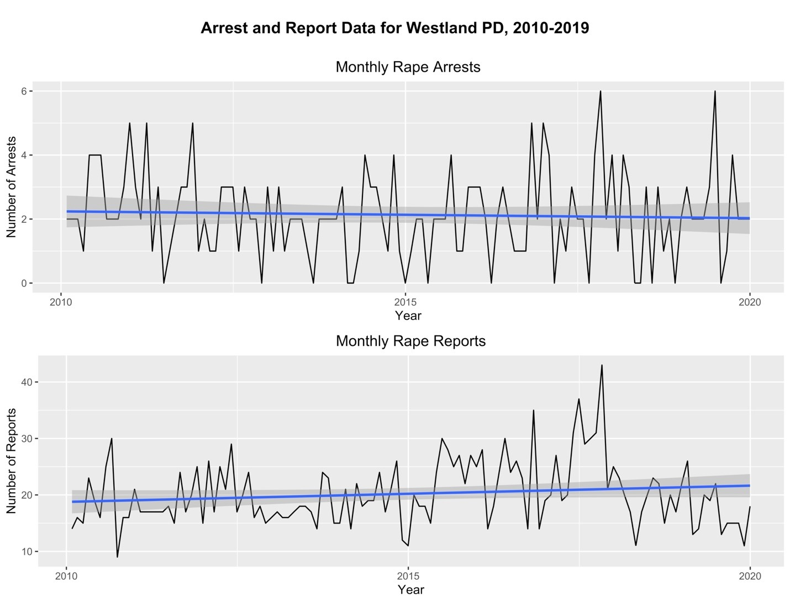
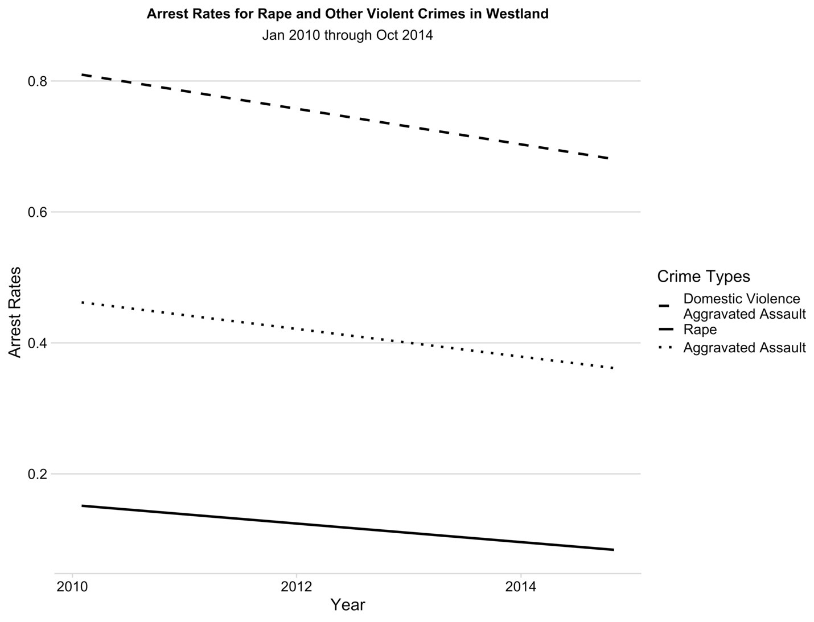

Authors:  
  - [Scott M. Mourtgos](https://smourtgos.netlify.app/), University of Utah[^1]
  - [Ian T. Adams](https://ianadamsresearch.com), University of Utah
  - [Justin Nix](https://jnix.netlify.app/), University of Nebraska Omaha
  - [Tara Richards](https://scholar.google.com/citations?user=VZ_LDHQAAAAJ), University of Nebraska Omaha

[^1]: Corresponding author: Scott M. Mourtgos, University of Utah, scott.mourtgos\@utah.edu

# Introduction

Untested sexual assault kits (SAKs) represent a critical public policy gap in addressing sexual assault, with estimates suggesting that as many as 400,000 SAKs remain untested in police storage across the country (Office of the Press Secretary, 2015). Indeed, despite the evidentiary usefulness of SAKs (Valentine et al., 2019), large numbers of SAKs are ‘shelved’ and never submitted to crime laboratories for analysis (Campbell et al., 2015; Hendrix et al., 2019; Lovell et al., 2018; Lovrich et al., 2004; Wells, 2016). The fact that many SAKs remain untested has resulted in pointed critiques of police investigatory practices in sexual assault cases (Campbell et al., 2019; Campbell & Fehler-Cabral, 2019; Goodman-Williams & Campbell, 2019; Valentine et al., 2019) and has served as a catalyst for mandatory SAK testing policies at both the state and municipal levels over the past decade (Davis et al., 2020).
Prior research has suggested many potential reasons to implement mandatory SAK testing policies. These include: identification of serial rapists, increased reporting of sexual assaults, populating the Combined DNA Index System (CODIS) with offender profiles, and removing bias from the decision-making process for whether to submit a particular SAK (Campbell et al., 2019; Davis et al., 2020; Goodman-Williams & Campbell, 2019; Hendrix et al., 2019; Lovell et al., 2019; Valentine et al., 2019). An additional proposed benefit to mandating SAK testing, which we focus on in this study, is higher rates of arrest for sexual assault (Davis et al., 2020). An increased arrest rate for sexual assault—as a means of holding more offenders accountable and restoring justice to more victims—is a shared goal among police, advocates, researchers, and policymakers. Sexual assault continues to be the most under-reported violent crime in the US (Langton et al., 2012; Lonsway & Archambault, 2012), and criminal justice system attrition among cases that are reported is high (Richards et al., 2019). For example, according to the FBI, in 2018, just 18 percent of rapes reported to law enforcement resulted in an arrest (FBI, 2019), and at least one study suggests that only between 3 and 26 percent of reported sexual assault cases result in a conviction (Lonsway & Archambault, 2012).

While there is a need for scientific evidence in the formulation of crime policy (Gies et al., 2020), surprisingly little attention has been directed at whether mandatory SAK testing policies do in fact increase arrest rates for sexual assault (Hendrix et al., 2019; Strom & Hickman, 2016). If a primary goal of an improved criminal justice response to sexual assault is to provide justice to more victims and hold more offenders accountable, an increase in the sexual assault arrest rate is necessary. Arrests are an important marker of sexual assault investigations (Alderden & Ullman, 2012; Ylang & Holtfreter, 2019) and a required prerequisite to an improved criminal justice response to sexual assault investigations. If mandatory SAK testing policies do not provide a demonstrable improvement in the rate of arrest for sexual assaults, it could result in lost legitimacy for the police, which might in turn decrease victims' propensity to come forward (Murphy & Barkworth, 2014; Sunshine & Tyler, 2003; Tankebe, 2013). Accordingly, research assessing the efficacy of mandatory SAK testing policies is sorely needed.

In the current study, we examine the effects of a mandatory SAK testing policy on sexual assault arrests in a large jurisdiction in the western US. We accomplish this by utilizing a novel technique known as Bayesian structural time-series modeling, a type of time-series quasi-experimental method (Brodersen et al., 2015b). Our findings show no effect on the arrest rate for sexual assault and raise significant concerns about the efficacy of mandatory SAK testing policies to increase arrests. Further, they highlight the need to ensure appropriate resources are provided to investigating agencies and crime laboratories when such policies are considered (Wells, 2016), as well as to consider other causes of low sexual assault arrest rates.

# Sexual Assault Kits (SAKs)

The collection of medical forensic evidence in sexual assault investigations became common practice in the 1980s (Goodman-Williams & Campbell, 2019). It is now routine for law enforcement to encourage sexual assault victims to undergo a forensic interview including a SAK upon reporting an incident. Typically performed by sexual assault nurse examiners (SANEs), SAK examinations include collecting biological evidence, such as semen and saliva, which may be present on victims' bodies post-sexual assault. After collection, SANEs supply the SAK to law enforcement for use in the investigatory process (Valentine et al., 2019). With the availability of the CODIS database, deoxyribonucleic acid (DNA) profiles collected during SAK examinations can be compared against DNA profiles of arrestees, convicted offenders, and other SAK evidence and crime scenes from across the United States (Butler, 2005; Jobling & Gill, 2004; Wells et al., 2019).

The ability to identify and evaluate DNA profiles obtained during sexual assault investigations holds significant investigatory power. For example, unknown perpetrators can be identified if their DNA profile is already housed in CODIS. Investigators may also identify serial offenders by linking a specific DNA profile to multiple sexual assault cases and victims (Goodman-Williams & Campbell, 2019; Lovell et al., 2019). The benefits are not just realized in CODIS utilization, however. While a substantial proportion of sexual assault cases hinge on issues of consent, simply being able to confirm that biological evidence collected during a SAK examination belongs to a specific suspect who denies any sexual contact with the victim can be potent evidence of guilt.

Yet, even with these clear evidentiary benefits, there have been multiple reports over the last decade, from all across the United States, describing how large quantities of SAKs have been left untested in police evidence warehouses (Valentine et al., 2019). For example, in 2002, it was reported that approximately 13,000 SAKs collected in Los Angeles County were never submitted for testing. In 2009, more than 11,000 unsubmitted SAKs were located in a Detroit Police Department evidence warehouse (Hendrix et al., 2019). Similarly, thousands of untested SAKs were found in Cuyahoga County, Ohio (Campbell & Fehler-Cabral, 2019). Of course, the exact number is unknown, as many jurisdictions report being unaware of precisely how many untested SAKs they possess (Keteyian, 2009).

Considering the advantages above, why might so many SAKs go untested? Until the recent exposure of large numbers of untested SAKs, the decision to submit SAKs to a crime laboratory for DNA processing was left to individual police investigators' discretion. Paralleling how they pursue investigations for other crimes (Brandl & Frank, 1994; Eck, 1983, 1992; Lum et al., 2018; Scott et al., 2019; Wellford & Cronin, 1999), there are several reasons why investigators might choose not to submit a SAK for testing. First, a non-trivial number of victims do not proceed with investigations once the initial allegation is made (Campbell et al., 2015; Richards et al., 2019; Wells, 2016), thus curtailing the ability to investigate or prosecute the case. Processing SAKs in cases that will not lead to any criminal proceedings/charges is arguably an inefficient use of limited resources (Davis et al., 2020). Second, in most sexual assault cases, the offender is known (Richards et al., 2019), and investigators may conclude that processing SAKs will not yield any probative value to those cases. Third, in some cases, offenders admit to the sexual assault. In cases where a confession is already obtained, the need for DNA evidence may be seen as unnecessary (Davis et al., 2020; Strom & Hickman, 2016). Fourth, investigators become accustomed to factors within cases that determine whether prosecutors will file charges. If the circumstances of a particular case do not meet those standards (i.e., a 'trial sufficiency' standard), investigators may not submit a SAK in order to conserve agency resources. This is referred to as 'downstream orientation' (Alderden & Ullman, 2012; Frohmann, 1991; Pattavina et al., 2016; Spohn & Tellis, 2019; Ylang & Holtfreter, 2019). Finally, investigators may not submit a SAK because they do not think the complainant is credible (Campbell et al., 2015; Davis et al., 2020; Hendrix et al., 2019).

There are, however, many theorized advantages to police investigators submitting all SAKs. First, by removing discretion for the submission of SAKs, the presence of extra-legal factors associated with stereotypes about 'real rape' (Estrich, 1987; e.g., victim drug or alcohol use, sex worker status, and antecedent victim "risk-taking" behavior) that may bias investigators' decision-making are mitigated (Davis et al., 2020). A recent study identified these extra-legal characteristics as the primary influencers of investigator decisions to submit SAKs for testing, which the authors deem "justice denied for...sexual assault victims whose fully collected SAKs were never submitted for analysis" (Valentine et al., 2019, p. 3565). Second, any obtained DNA evidence helps corroborate victims' statements, even if the suspect is already known or has confessed (Campbell et al., 2019; Campbell & Fehler-Cabral, 2019). Third, retrieval of DNA profiles from all sexual assault cases will result in the identification and (hopefully) arrest and prosecution of serial offenders (Campbell et al., 2019; Davis et al., 2020; Lovell et al., 2019). Finally, advocates of mandatory SAK testing policies argue arrests, prosecutions, and convictions of sex offenders in general will increase (Davis et al., 2020). This final argument found some empirical support after an additional 600 indictments and 400 convictions were associated with testing SAKs that had previously been backlogged in Cuyahoga County, Ohio (Lovell et al., 2018). What remains unclear is whether these same expectations hold for mandatory testing of new SAKs, a discussion we return to later.

There are convincing normative arguments for the viewpoints described above. However, the past decade has seen those advocating for mandatory testing policies gaining ground in the policy sphere. According to [endthebacklog.org](endthebacklog.org) (2020), a program of the national nonprofit organization Joyful Heart Foundation, in 2019 alone, 103 bills were introduced in 35 states and Washington DC explicitly addressing concerns about the handling of SAKs. Further, 12 states have passed comprehensive SAK reform, including (1) inventorying and testing of all untested SAKs, and (2) timely testing of newly obtained SAKs.

## Outcome Evidence from Texas

Given the evidence above, the question remains: do prospective mandatory testing policies achieve the desired outcomes? With the exception of identifying serial offenders (Campbell et al., 2019; Lovell et al., 2019), little work has been conducted to test these policies' outcomes. To our knowledge, only one other empirical test of prospective mandatory SAK testing policies has been undertaken. Davis et al. (2020) examined the policy outcomes of a compulsory statewide SAK testing law in Texas, otherwise known as Senate Bill 1636 (SB 1636). Texas was one of the first states to enact state legislation requiring the testing of all SAKs. In 2011, SB 1636 was passed, mandating that law enforcement agencies submit SAKs to a crime laboratory within 30 days of receipt. Advocates for the bill anticipated that it would lead to an increase in sexual assault reporting, as well as an increase in sexual assault arrests, prosecutions, and convictions.

Contrary to their hypotheses, Davis et al. (2020) did not find support for increased sexual assault reporting, sexual assault arrests, or sexual assault court filings and convictions across a 4-year pre- and post-policy implementation period. Davis et al. report that "[u]niversal testing of DNA in sexual assault cases, by itself, may be insufficient to promote meaningful changes in reporting and criminal justice system indicators that some may have expected" (p. 433). They identify inadequate crime laboratory funding as one primary possible reason for their null findings, as the crime laboratory was overwhelmed with the substantial increase in SAK submissions, resulting in lengthy turnaround times for analyses.

Another possible reason for Davis et al.'s (2020) null findings is that their study tests the effects of SB 1636 on the crimes of "sexual assault" and "aggravated sexual assault." It is unclear from their study which specific crimes these terms encompass. Clear operationalization is vital when assessing the possible effects of mandatory testing policies because the term sexual assault can be ambiguous. That is, sexual assault encompasses not only rape but also other illegal behaviors, such as unwanted touching or sexual harassment in the workplace. When examining the effect of a mandatory SAK testing policy, specificity is critical. In the interest of greater specificity, we closely examine the effects of a mandatory testing policy on arrests for rape. Throughout this manuscript, we may reference "sexual assault" when discussing sexual violence in general, but when discussing the mandatory testing policy's effects, we are explicitly referring to rape. Finally, Davis et al.'s (2020) study examined the effect of a mandatory SAK testing policy across an entire state, which may have masked important variation across jurisdictions therein. Our research examines one jurisdiction's experience with mandatory SAK testing.

# The Current Study

In the current study, we focus on arrests for rape. While there are conflicting findings in the limited research literature examining whether analysis of previously untested SAKs leads to an increase in positive case outcomes (Campbell & Fehler-Cabral, 2019; Peterson et al., 2012), we examine the effects of requiring testing of all SAKs at the time they enter the criminal justice system. The only study that we are aware of that tested whether prospective mandatory SAK submission policies increase sexual assault arrests found that they do not (Davis et al., 2020).

There is some indication that SAK testing by crime laboratories enhances criminal justice processing of sexual assault cases (Valentine et al., 2019). However, it is unclear if improved case outcomes are because of the tested SAK itself, or if cases with tested SAKs are already more likely than other cases to result in positive case outcomes due to legal or extra-legal factors. Further, Davis et al. (2020) found a non-significant decreasing trend in sexual assault arrest rates in their study following implementation of a mandatory testing policy. Davis and colleagues indicated that this was possibly due to a failure to provide adequate resources for the entire investigatory system following the mandatory SAK testing policy (specifically crime laboratory resources). The jurisdiction we studied experienced a similar inadequacy of secondary resourcing upon policy implementation. With this in mind, we developed the following research hypothesis regarding the policy effect on the arrest rate for rape:

*Hypothesis: Mandatory testing of SAKs will not lead to an increase in the proportion of rape reports that result in an arrest.*

# Data and Method

## Data

We utilize reported crime and arrest data from an anonymous municipal police department that serves a capital city in the western United States (hereafter referred to as "Westland"). The Westland Police Department (WPD) provides full-spectrum policing services to a mixed urban core and suburban service area with an estimated nighttime population of 200,000 residents and a metropolitan population of over one million. The department employs approximately 600 sworn officers and has a specified unit within its investigation division responsible for investigating all sexual assault allegations (a special victims unit).

In 2014, WPD came under public criticism regarding past non-testing of SAKs for sexual assault investigations. From 2004 through 2013, approximately 77% of all SAKs received by WPD were never submitted to a crime laboratory for processing. As a result, and despite agency leadership arguing for a more limited policy, a city ordinance was passed, requiring all SAKs received by WPD be submitted to a crime laboratory for analysis within 30 days of receipt. The policy was implemented on November 1, 2014, and was effective immediately. This sharp implementation is a critical aspect of our research design, as it allows us to leverage the power of a natural experiment to analyze trends during the pre- and post-implementation periods. With immediate effect, every SAK that came into WPD's special victims unit on or after November 1, 2014, was submitted to the state crime laboratory for testing. When a series of measures is broken up by the introduction of an intervention that occurs at a specific point in time, time-series analysis is appropriate (Davis et al., 2020; Shadish et al., 2002). The enactment of the mandatory SAK testing policy in Westland provides an opportunity for a time-series quasi-experiment to ascertain the impact (if any) of the policy on arrest rates for rape.

## Measures

**Rape arrest rates**. Our measure of rape arrest rates is constructed from agency-level data. By policy, at WPD a SAK is obtained whenever possible in all reported incidents of rape. This policy is because, unlike some forms of sexual assault, there is a high likelihood of obtaining biological evidence containing DNA after a rape is committed. When taking a sexual assault complaint, officers in Westland have to designate the type of crime being reported in the agency's report writing system using a National Crime Information Center (NCIC) code. There are many designated codes related to crimes of sexual assault. For example, there are several sexual assault codes for child molestation, sexual assaults not involving penetration, rape, and more. By creating our measure with these codes at the agency level, we restrict our study to the crime of rape, as defined in the studied jurisdiction. The state in which Westland is located defines rape as "sexual intercourse with another person without the victim's consent." We documented the total number of rapes reported to WPD, along with the total number of arrests for rape, from 2010 through 2019, providing 120 monthly time-series measures. We defined an arrest as any instance in which a person was arrested, summoned to court, or had a warrant issued for their arrest. The arrest rate was calculated by dividing the number of arrests for rape in each month by the total number of rapes reported each month. **Figure 1** displays the time-series data for rape arrests and reports in Westland.

## Model Description

A Bayesian structural time-series model (BSTS) is a state-space time-series model that includes one component of state as a linear regression on the predictors. While we summarize the method below, a much more technical explanation of BSTS modeling is provided by Brodersen et al. (2015b), the developers of the method.

Concisely, BSTS is best described as an observation equation, which links the observed data with an observed latent state and transition equation. The transition equation describes the development of the latent state over time. The observation equation is defined as $$y_t = Z_t^T α_t + ε_t$$

where $y_t$ is a scalar observation (i.e., arrest rate), $Z_t$ is an output vector, and $α_t$ is the unobserved latent state; $ε_t ~ N(0, σ_t^2)$ is independent of all other unknowns and is a scalar observation error with variance $σ_t$.

The transition equation is defined as $$α_(t+1)  = T_t α_t+ R_t η_t$$

where $α_t$ is the unobserved latent state, $T_t$ is the transition matrix, and $R_t$ is the control matrix; $η_t \sim N(0, Q_t)$ is independent of all other unknowns and describes the system error with a state-diffusion matrix $Q_t$. $R_t η_t$ allows the inclusion of seasonality in the analysis.

BSTS models infer causal impact by predicting the counterfactual treatment response in a synthetic control that would have occurred if no intervention had taken place. That is, rather than comparing the experimental group to a nonequivalent control group, BSTS models use a synthetic control to construct the counterfactual to estimate the treatment effect. This synthetic control is constructed by using the time-series behavior of the experimental group prior to and after the intervention, as well as combining control variables that are predictive of the target series prior to the intervention. As long as the control variables did not receive the intervention, it is reasonable to assume the relationship between the treatment and the control variables that existed prior to the intervention would continue if the treatment had no effect. As such, a plausible estimate of the counterfactual time-series can be estimated up to the point where the relationship between treatment and controls are no longer stationary because of the treatment (Brodersen et al., 2015c; de Vocht et al., 2017; Liu & Fabbri, 2016; Ratcliffe et al., 2017).

Use of BSTS models are ideal for social science (Brodersen et al., 2015b), and have been used successfully in other criminological studies to estimate violence reduction as a result of gang arrests (Ratcliffe et al., 2017); the deterrence effect of unarmed private patrols (Liu & Fabbri, 2016); and the effect alcohol licensing policies have on crime (de Vocht et al., 2017). Further, BSTS models are preferred to Auto Regressive Integrated Moving Average (ARIMA) models when examining crime data because crime data is low-volume count data, which may be inappropriate for ARIMA modeling (Ratcliffe et al., 2017).

**Counterfactual predictor.** A key component of utilizing BSTS modeling is the identification of appropriate predictors. Predictors are linearly regressed onto the observed values, creating the composite synthetic control series (Brodersen et al., 2015b; Ratcliffe et al., 2017). To build the synthetic control for the time-series, we turn to other violent crimes. It is well established that violent crimes tend to track with each other across time (Latzer, 2016; Lonsway & Archambault, 2012; Yung, 2013). To ascertain whether arrest rates for rape are associated with arrest rates for other violent crimes in Westland, we examined the arrest rates for aggravated assault, domestic violence aggravated assault, simple assault, robbery, and homicide. We found that the arrest rates for aggravated assault and domestic violence aggravated assault most closely mirrored the arrest rate for rape from January 2010 through October 2014 (the pre-intervention time-period). We plot the arrest rate for rape with the arrest rates for aggravated assault and domestic violence aggravated assault in Westland in **Figure 2**.

Based on the above analysis, the arrest rates for aggravated assault and domestic violence aggravated assault in Westland are utilized to construct the synthetic control. Importantly, the arrest rate for aggravated assault and domestic violence aggravated assault would not plausibly be affected by the mandatory SAK testing policy. Moreover, as mentioned previously, WPD employs a specialized detective unit to investigate all sexual assaults. As such, detectives investigating aggravated assaults (investigated by a violent crimes unit at WPD) and domestic violence aggravated assault (investigated by a domestic violence unit at WPD) would not be affected by this policy. Thus, any change in the rate of arrests for rape that is not also observed in the rate of arrests for either of the aggravated assault categories may reasonably be attributed to the mandatory submission policy.

# Analysis and Results

We used the R package `CausalImpact` (Brodersen et al., 2015a) to conduct the analysis. The model uses a response variable comprised of the monthly arrest rate for rape, and the predictor variables: the arrest rates for aggravated assault and domestic violence aggravated assault. The BSTS model was structured to allow for a seasonal parameter to reflect any yearly cyclical behavior on the arrest rate for rape (Mcdowall et al., 2012; Mcdowall & Curtis, 2015).

The pre-intervention time series began in January 2010 and ended in October 2014, as the mandatory SAK testing policy was enacted on November 1, 2014. The post-intervention time-series began in November 2014 and continued through December of 2019. Accordingly, the pre-intervention series is 58 data points in length, with a post-intervention length of 62 months. Ten thousand Markov chain Monte Carlo (MCMC) samples were drawn for the analysis in each model. Ninety-five percent Bayesian posterior distribution credible intervals were generated. Results for the model assessing change in the arrest rate for rape are presented in **Figure 3**.

<aside>

The frequentist analog to a credible interval is a confidence interval, yet the two concepts are statistically different. In a frequentist paradigm, confidence intervals are based on repeated sampling theory. A 95% confidence interval indicates that 95 out of 100 replications of exactly the same experiment will capture the fixed, but unknown, regression coefficient. A credible interval can be interpreted as the probability that the population parameter is between the upper and lower bounds of the credible interval, based on the available information (Van de Schoot & Depaoli, 2014).

</aside>

**Figure 3** contains three panels. The panel labeled "original" shows the data and a counterfactual prediction for the post-treatment period. The counterfactual prediction is the horizontal dashed line, with a corresponding 95% credible interval surrounding it. The solid line represents the observed data. The panel labeled "pointwise" represents the pointwise causal effect, as estimated by the model. That is, it shows the difference between observed data and counterfactual predictions. The panel labeled "cumulative" visualizes the cumulative effect of the intervention post-treatment by summing the pointwise contributions from the second panel. The dashed vertical line represents the intervention date (i.e., November 2014).

**Table 1: Causal Impact Posterior Inference**

|                         | _Average_ | _SD_  | _95% CI_          |
| ----------------------- | --------- | ----- | ----------------- |
| _Actual Arrest Rate_    | 0.097     |       |                   |
| _Predicted Arrest Rate_ | 0.120     | 0.045 | \[0.029, 0.200\]  |
|                         |           |       |                   |
| _Absolute Effect_       | \-0.018   | 0.045 | \[-0.110, 0.069\] |
| _Relative Effect_       | \-16%     | 39%   | \[-92%, 59%\]     |

As indicated in **Table 1**, the enactment of the mandatory SAK submission policy at WPD was associated with a decrease in the arrest rate for rape. During the post-intervention period, the arrest rate for rape had an average value of .097. By contrast, in the absence of an intervention, we would have expected a counterfactual average of .120. The 95% credible interval of the counterfactual prediction is [0.029, 0.200]. Subtracting this prediction from the observed response yields an estimate of the absolute causal effect the intervention had on the arrest rate for rape (-.018), resulting in a 16% relative decrease. The posterior probability of the observed negative effect is .66. In other words, although it appears the intervention may have exerted a negative effect on the arrest rate for rape, the effect is not statistically significant by conventional standards (i.e., the probability of obtaining this effect by chance is .34). In sum, we observed a downward trend that departs from the counterfactual we estimated. However, we cannot say with a considerable probability that the observed negative trend was a result of the policy implementation. The most conservative interpretation is that, consistent with our hypothesis, the policy implementation did not have an effect on rape arrest rates.

# Discussion

There have been calls within academic, advocacy, and policy circles over the past several years to increase accountability for those who commit sexual violence (Sacco & James, 2015; Valentine et al., 2019; Watkins, 2019). One proposed policy intervention to meet these appeals is that of mandatory SAK testing policies. It has been theorized that requiring all SAKs to be submitted to crime labs for DNA analysis will increase the ability to identify and hold offenders accountable (Campbell et al., 2019; Campbell & Fehler-Cabral, 2019; Davis et al., 2020; Lovell et al., 2019; Valentine et al., 2019).

In search of these desirable outcomes, as of 2019, 12 states have passed comprehensive SAK reform, which includes mandatory testing of newly obtained SAKs (Endthebacklog.org, 2020). Methodologically rigorous evaluations of these policies are scant (Hendrix et al., 2019; Strom & Hickman, 2016), but absolutely critical. If mandatory testing policies are not producing the desired results, further investigation is necessary to understand if and how policies could be amended or supplemented to better achieve the desired results. That is, if arrest rates for sexual assault are not increasing, there must be other determinative factors at play that should be addressed.

In this study, we examined the above question. We tested the effect of a mandatory SAK testing policy on the arrest rate for rapes in one jurisdiction after a mandatory SAK testing policy was implemented. We accomplished this by using a Bayesian structural time-series model with 120 longitudinal data points. As hypothesized, our model found that the mandatory SAK testing policy did not lead to an increase in the arrest rate for rape, but instead had a null, or possibly a negative, effect (probability = .66).

It appears then, at least in Westland, a mandatory SAK testing policy did not have the effect of increasing the arrest rate for rapes---an often-stated goal of those who advocate for such policies (Davis et al., 2020). The implementation of mandatory testing policies "is not merely to test rape kits, but to investigate and prosecute the reported sexual assaults associated with these kits" (Campbell & Fehler-Cabral, 2019, p. 2). We agree. We call attention to several other studies, as well as anecdotal evidence obtained from conversations with the investigators at WPD, to help explain these findings.

The only other similar study we are aware of examines the effect of a statewide mandatory submission policy in Texas. Davis et al. (2020) found that implementing a statewide mandatory SAK submission policy did not increase sexual assault arrests or convictions, but did increase the workload for investigators and crime laboratories.

<aside>

While not statistically significant, much like our analysis Davis et al. (2020) finds a general decrease in the sexual assault arrest rate after the mandatory testing policy implementation.

</aside>

The large influx of SAKs for testing created a backlog for incoming cases (not to be confused with previously untested kits). Through interviews with sexual assault investigators and crime lab personnel, Davis and colleagues found that after implementation of the mandatory testing policy, completion of analysis for newly incoming SAKs was taking 10-11 months. Investigators stated that having to wait up to a year for SAK analysis results commonly prompted victims to drop out of the criminal justice process. Davis et al. warn that mandated testing may be insufficient to promote meaningful changes without sufficient additional funding directed to the affected agencies.

Davis et al.'s (2020) description of underfunded crime laboratory resources following a mandatory SAK testing policy is mirrored in the state where Westland is located. In 2017, the state legislature passed a new state law, mandating submission of all SAKs throughout the state, effective immediately (much like the municipal SAK policy implemented solely in Westland in 2014). During the 2018 legislative session, news stories reported that the state crime laboratory could not keep up with testing demand. In response, the state legislature gave law enforcement agencies slightly expanded time frames to come into compliance. In 2020, the state crime laboratory requested millions in additional funding due to a 535% increase in SAK submissions between 2012 and 2019.

Hendrix et al. (2019) also call attention to a lack of resources for SAK testing. While they did not test the implementation of a mandatory testing policy specifically, their findings are instructive. Hendrix et al. found that a lack of resources primarily drives non-submission of SAKs by agencies without mandatory testing policies. The researchers found that the most important resource input, when attempting to increase the use of SAKs, is increasing the number of detectives assigned to investigating sexual assault cases. In their study, SAK submission increased 24% for every 100% increase in detectives.

Additionally, a common explanation for not submitting a SAK was the inability of crime labs to produce timely results. This limitation is relevant to our findings for the following reasons. Based on Hendrix et al.'s findings, voluntary investigative submission of SAKs rises with increased investigatory resources. However, a continuing reason to not submit SAKs is the inability of crime laboratories to provide timely turnaround on analyses, a concern echoed elsewhere (e.g., Strom & Hickman, 2016). Policies may be implemented that require all SAKs to be submitted, but without an adequate increase in resources for investigators and the crime laboratories responsible for analyzing the submitted SAKs, mandatory policies may harm victims in the sense that both investigating agencies and crime labs are logistically overwhelmed. This logjam may increase turnaround time on SAK analyses, and thus increase turnaround time on the entire investigation. The lengthy timeline between victim reporting and law enforcement action may lead to frustration from victims, and ultimately their withdrawal from the justice process (Kääriäinen & Sirén, 2011; Tarling & Morris, 2010).

Anecdotal evidence from interviews with investigators at WPD lends credence to this possibility. Before mandatory SAK submission policy implementation, investigators were already waiting extended periods for SAK DNA analysis results, ranging from six months to one year. Following the policy implementation, the average turnaround time for SAK DNA analyses increased to between eighteen months to two years. Investigators reported victim withdrawal due to these ever-growing wait times for SAK testing. The increased delay overlapped with a substantial increase in investigatory resources. From the policy implementation to 2018, the detective unit responsible for investigating sexual assaults increased by a third---from six detectives to eight detectives. Three additional detectives have been added since 2018, indicating WPD is still attempting to balance its investigative resources. At the least, the nearly doubling of detectives in the special victims unit since policy implementation suggests that whatever mechanism drives the stagnant (or decreasing) arrest rate is not related to a decrease in the number of investigators.

It must be considered that perhaps submission of all SAKs simply does not provide the additional evidence needed to increase accountability for sexual assault offenders. While several studies indicate that testing SAKs is associated with positive case outcomes (Valentine et al., 2019), it must be remembered that the vast majority of sexual assault cases involve known perpetrators (Richards et al., 2019). If the hope is that DNA analysis from SAKs will increase arrest and prosecution for sexual assaults, expectations may need to be tempered. That is, DNA evidence is not especially helpful when prosecutors are trying to prove a lack of consent (Spohn & Tellis, 2014). While an increase in DNA profiles in CODIS will likely assist in identifying serial rapists, DNA evidence from non-serial sexual assaults where the suspect is known and claims consent may not provide the benefit desired by proponents of mandatory SAK submission policies.

Finally, it should also be considered that investigator discretion was interpreting the 'downstream orientation' of prosecuting entities correctly in the majority of sexual assault cases (Alderden & Ullman, 2012; Frohmann, 1991; Richards et al., 2019; Spohn & Tellis, 2014, 2019). Prosecutorial discretion is a major source of influence in the handling of criminal cases (Mourtgos & Adams, 2019; Pfaff, 2017). While calls for improved sexual assault investigatory practices (Campbell et al., 2019; Campbell & Fehler-Cabral, 2019; Goodman-Williams & Campbell, 2019; Valentine et al., 2019) are warranted, perhaps additional attention should be paid to prosecutorial handling of sexual assault cases. So, while SAK testing may be mandated, and investigatory resources may be expanded and improved, increased accountability for sexual assault perpetrators remains dampened if sexual assault cases are not charged and prosecuted.

Policymakers, victims, and the public should continue to demand that sexual assault investigations receive full and proper treatment. SAK testing policies are a necessary component, but as our results show, mandating SAK testing is not sufficient on its own. We join Davis et al. (2020) in their emphasis on recommending elevated funding of the system around sexual assault investigations. If adequate funding and resources are not provided to the investigating agencies and crime laboratories concurrently with these policies, increased offender accountability is unlikely to occur, as outlined in our study, as well as other empirical research (Davis et al., 2020). Also, resources must be invested in other 'victim-facing' services, particularly victim advocates who serve as liaisons between victims and the criminal justice system (Rich & Seffrin, 2013). Research demonstrates that victim advocates are associated with positive victim outcomes, including victim engagement with law enforcement and prosecutors (Patterson & Campbell, 2010).

Given that mandatory SAK testing is likely associated with increased wait times, victim advocates may be critical to keeping victims informed, and thus engaged in the process. Other potential components of a holistic approach to SAKs include online tracking systems that allow victims to follow the progress of their SAK in real-time without having to work through law enforcement officers or victim services (Carlisle, 2019). Again, given the historical undertesting of SAKs, increased criminal justice system transparency is likely critical to building and sustaining trust from victims of sexual assault.

# Limitations and Future Research

We contribute important findings to this nascent body of knowledge, but this research is not without limitations. First, this study looks at a single jurisdiction. WPD is a large agency with approximately 600 sworn officers, with jurisdiction of a major metropolitan capital city in the Western US, and with a dedicated special victims unit. Though our results build on similar findings (Davis et al., 2020), that study also took place in a Western US state. To the degree that there may be regional differences, it is not clear how our findings will generalize to other parts of the US, or to smaller, exurban, suburban, and rural communities. We suspect that given the more considerable resources available to large metropolitan police forces, and the greater specialization of investigators found there, non-metropolitan jurisdictions may see negative effects of even greater magnitude and certainty than found in our study. However, that question must be answered in future research.

A second limitation is related to the scope of our research. We do not propose or pursue a full accounting of the costs, benefits, outputs, and outcomes of the mandatory SAK testing policy, but restrict our analysis to the primary indicator of clearance by arrest of rape cases. There are likely other benefits and costs incurred by the policy, and we encourage a fuller accounting in future work. Related to both generalizability and scope concerns, our single jurisdiction is located in a state that only recently passed a law mandating SAK testing across the state. While we are not able to analyze the results of that statewide law, we encourage other researchers to pursue similar research and build the empirical foundation for understanding the effect of mandatory SAK testing policies and laws. For a host of ethical and logistical reasons, it is not likely that a true randomized control trial will be available. As demonstrated here, Bayesian structural time-series provides an accessible and relatively easy method to leverage the implementation of those policies with natural experimental designs.

# Conclusion

Mandatory testing of SAKs has been rapidly adopted in criminal justice investigations, but to date, the empirical record for understanding the effects of those policies has been extremely limited. Our findings suggest that following implementation of such a policy, the arrest rate in cases most likely to result in a SAK being performed showed, at best, no change, and a substantial probability of a decrease. These outcomes should give policy makers and police administrators pause. They suggest that going forward, a substantial increase in resources is necessary across the investigative and victim service systems before the desired change in criminal justice system outcomes are realized. Further, reforms and policy changes other than mandatory SAK testing policies are likely required to increase accountability for sexual assault offenders.

\newpage

# References

Alderden, M. A., & Ullman, S. E. (2012). Creating a more complete and current picture: Examining police and prosecutor decision-making when processing sexual assault cases. *Violence Against Women*, 18(5), 525--551. <https://doi.org/10.1177/1077801212453867>

Brandl, S. G., & Frank, J. (1994). The relationship between evidence, detective effort, and the disposition of burglary and robbery investigations. *American Journal of Police*, 13(3), 149--168.

Brodersen, K. H., Gallusser, F., Koehler, J., Remy, N., & Scott, S. L. (2015a). `CausalImpact`. <http://google.github.io/CausalImpact/>

Brodersen, K. H., Gallusser, F., Koehler, J., Remy, N., & Scott, S. L. (2015b). Inferring causal impact using bayesian structural time-series models. *Annals of Applied Statistics*, 9(1), 247--274. <https://doi.org/10.1214/14-AOAS788>

Brodersen, K. H., Gallusser, F., Koehler, J., Remy, N., & Scott, S. L. (2015c). Inferring causal impact using bayesian structural time-series models. *Annals of Applied Statistics*, 9(1), 247--274. <https://doi.org/10.1214/14-AOAS788>

Butler, J. M. (2005). *Forensic DNA typing: Biology, technology, and genetics of STR markers* (2nd ed.). Elsevier Academic Press.

Campbell, R., Feeney, H., Goodman-Williams, R., Sharma, D. B., & Pierce, S. J. (2019). Connecting the dots: Identifying suspected serial sexual offenders through forensic DNA evidence. *Psychology of Violence*. <https://doi.org/10.1037/vio0000243>

Campbell, R., & Fehler-Cabral, G. (2019). The best way out is always through: Addressing the problem of untested sexual assault kits (SAKs) through multidisciplinary collaboration. *Victims & Offenders*. <https://doi.org/10.1080/15564886.2019.1679309>

Campbell, R., Fehler-Cabral, G., Pierce, S. J., Sharma, D. B., Bybee, D., Shaw, J., Horsford, S., & Feeney, H. (2015). The Detroit sexual assault kit (SAK) action research project (ARP), final report.

Carlisle, M. (2019). A new system to ensure that sexual assault cases aren't forgotten. *The Atlantic*.

Davis, R. C., Auchter, B., Wells, W., Camp, T., & Howley, S. (2020). The effects of legislation mandating DNA testing in sexual assault cases: Results in Texas. *Violence Against Women*, 26(5), 417--437. <https://doi.org/10.1177/1077801219838330>

de Vocht, F., Tilling, K., Pliakas, T., Angus, C., Egan, M., Brennan, A., Campbell, R., & Hickman, M. (2017). The intervention effect of local alcohol licensing policies on hospital admission and crime: A natural experiment using a novel Bayesian synthetic time-series method. *Journal of Epidemiology & Community Health*, 71(9), 912--918. <https://doi.org/10.1136/jech-2017-208931>

Eck, J. E. (1983). *Solving crimes: The investigation of burglary and robbery*.

Eck, J. E. (1992). *Solving crimes: The investigation of burglary and robbery*.

Endthebacklog.org. (2020). <http://www.endthebacklog.org/>

Estrich, S. (1987). *Real rape*. Harvard University Press.

FBI. (2019). Crime in the U.S. <https://ucr.fbi.gov/crime-in-the-u.s> Frohmann, L. (1991). Discrediting victims' allegations of sexual assault: Prosecutorial accounts of case rejections. *Social Problems*, 38(2), 213--226.

Gies, S. V., Healy, E., & Stephenson, R. (2020). The evidence of effectiveness: Beyond the methodological standards. *Justice Evaluation Journal*. <https://doi.org/10.1080/24751979.2020.1727296>

Goodman-Williams, R., & Campbell, R. (2019). How to right a wrong: Empirically evaluating whether victim, offender, and assault characteristics can inform rape kit testing policies. *Journal of Trauma & Dissociation*, 20(3), 388--303. <https://doi.org/10.1080/15299732.2019.1592645>

Hendrix, J. A., Strom, K. J., Parish, W. J., Melton, P. A., & Young, A. R. (2019). An examination of sexual assault kit submission efficiencies among a nationally representative sample of law enforcement agencies. *Criminal Justice Policy Review*. <https://doi.org/10.1177/0887403419884730>

Jobling, M. A., & Gill, P. (2004). Encoded evidence: DNA in forensic analysis. *Nature Reviews Genetics*, 5(10), 739--751. <https://doi.org/10.1038/nrg1455>

Kääriäinen, J., & Sirén, R. (2011). Trust in the police, generalized trust and reporting crime. *European Journal of Criminology*, 8(1), 65--81. <https://doi.org/10.1177/1477370810376562>

Keteyian, A. (2009). Exclusive: Rape in America: Justice denied. In CBS News. <https://www.cbsnews.com/news/exclusive-rape-in-america-justice-denied/>

Langton, L., Berzofsky, M., Krebs, C., & Smiley-McDonald, H. (2012). BJS Special Report.

Latzer, B. (2016). *The rise and fall of violent crime in America*. Encounter Books.

Liu, P., & Fabbri, M. (2016). More eyes, (no guns,) less crime: Estimating the effects of unarmed private patrols on crime using a Bayesian structural time-series model.

Lonsway, K. A., & Archambault, J. (2012). The "justicegGap" for sexual assault cases: Future directions for research and reform. *Violence Against Women*, 18(2), 145--168. <https://doi.org/10.1177/1077801212440017>

Lovell, R., Huang, W., Overman, L., Flannery, D., & Klingenstein, J. (2019). Offending histories and typologies of suspected sexual offenders identified via untested sexual assault kits. *Criminal Justice and Behavior*. <https://doi.org/10.1177/0093854819896385>

Lovell, R., Luminais, M., Flannery, D. J., Bell, R., & Kyker, B. (2018). Describing the process and quantifying the outcomes of the Cuyahoga County sexual assault kit initiative. *Journal of Criminal Justice*, 57, 106--115. <https://doi.org/10.1016/j.jcrimjus.2018.05.012>

Lovrich, N. P., Pratt, T. C., Gaffney, M., Johnson, C., Asplen, C., Hurst, L., & Schellberg, T. (2004). National forensic DNA study report, final report.

Lum, C., Wellford, C. F., Scott, T., Vovak, H., & Scherer, J. A. (2018). Identifying effective investigative practices: A national study using trajectory analysis, case studies, and investigative data.

Mcdowall, D., & Curtis, K. M. (2015). Seasonal variation in homicide and assault across large U.S. cities. *Homicide Studies*, 19(4), 303--325. <https://doi.org/10.1177/1088767914536985>

Mcdowall, D., Loftin, C., & Pate, M. (2012). Seasonal cycles in crime. *Journal of Quantitative Criminology*, 28(3), 389--410. <https://doi.org/10.1007/s>

Mourtgos, S. M., & Adams, I. T. (2019). The effect of prosecutorial actions on deterrence: A county-level analysis. *Criminal Justice Policy Review*. <https://doi.org/10.1177/0887403419829201>

Murphy, K., & Barkworth, J. (2014). Victim willingness to report crime to police: Does procedural justice or outcome matter most? *Victims & Offenders*, 9(2), 178--204. <https://doi.org/10.1080/15564886.2013.872744>

Office of the Press Secretary. (2015). Fact sheet: Investments to reduce the national rape kit backlog and combat violence against women. <https://obamawhitehouse.archives.gov/the-press-office/2015/03/16/fact-sheet-investments-reduce-national-rape-kit-backlog-and-combat-viole>

Pattavina, A., Morabito, M., & Williams, L. M. (2016). Examining connections between the police and prosecution in sexual assault case processing: Does the use of exceptional clearance facilitate a downstream orientation? *Victims & Offenders*, 11(2), 315--334. <https://doi.org/10.1080/15564886.2015.1046622>

Patterson, D., & Campbell, R. (2010). Why rape survivors participate in the criminal justice system. *Journal of Community Psychology*, 38(2), 191--205. <https://doi.org/10.1002/jcop.20359>

Peterson, J., Johnson, D., Herz, D., Graziano, L., & Oehler, T. (2012). Sexual assault kit backlog study.

Pfaff, J. F. (2017). *Locked in: The true causes of mass incarceration and how to achieve real reform*. Basic Books.

Ratcliffe, J. H., Perenzin, A., & Sorg, E. T. (2017). Operation Thumbs Down A quasi-experimental evaluation of an FBI gang takedown in South Central Los Angeles. *Policing: An International Journal of Police Stategies & Management*, 40(2), 442--458. <https://doi.org/10.1108/PIJPSM-01-2016-0004>

Rich, K., & Seffrin, P. (2013). Police officers' collaboration with rape victim advocates: Barriers and facilitators. *Violence and Victims*, 28(4), 687--696.

Richards, T. N., Skubak, M. S., & Wright, E. M. (2019). When victims refuse and prosecutors decline: Examining exceptional clearance in sexual assault cases. *Crime & Delinquency*, 65(4), 474--498. <https://doi.org/10.1177/0011128719828351>

Sacco, L. N., & James, N. (2015). Backlog of sexual assault evidence: In brief.

Scott, T. L., Wellford, C., Lum, C., & Vovak, H. (2019). Variability of crime clearance among police agencies. *Police Quarterly*, 22(1), 82--111. <https://doi.org/10.1177/1098611118796597>

Shadish, W. R., Cook, T. D., & Campbell, D. T. (2002). Quasi-experiments: Interrupted time-series designs. Experimental and quasi-experimental designs for generalized causal inference.

Spohn, C., & Tellis, K. (2014). *Policing and prosecuting sexual assault: Inside the criminal justice system*. Lynne Reinner Publishers, Inc. <https://doi.org/10.1145/1242421.1242427>

Spohn, C., & Tellis, K. (2019). Sexual assault case outcomes: Disentangling the overlapping decisions of police and prosecutors. *Justice Quarterly*, 36(3), 383--411. <https://doi.org/10.1080/07418825.2018.1429645>

Strom, K. J., & Hickman, M. J. (2016). Untested sexual assault kits: Searching for an empirical foundation to guide forensic case processing decisions. *Criminology & Public Policy*, 15(2), 593--601. <https://doi.org/10.1111/1745-9133.12213>

Sunshine, J., & Tyler, T. R. (2003). The Role of Procedural Justice and Legitimacy in Shaping Public Support for Policing. *Law & Society Review*, 37(3), 513--548.

Tankebe, J. (2013). Viewing Things Differently: The Dimensions of Public Perceptions of Police Legitimacy. *Criminology*, 51(1), 103--135. <https://doi.org/10.1111/j.1745-9125.2012.00291.x>

Tarling, R., & Morris, K. (2010). Reporting crime to the police. *The British Journal of Criminology*, 50(3), 474--490. <https://doi.org/10.1093/bjc/azqO>

Valentine, J. L., Sekula, L. K., Cook, L. J., Campbell, R., Colbert, A., & Weedn, V. W. (2019). Justice Denied: Low Submission Rates of Sexual Assault Kits and the Predicting Variables. *Journal of Interpersonal Violence*, 34(17), 3547--3573. <https://doi.org/10.1177/0886260516681881>

Van de Schoot, R., & Depaoli, S. (2014). Bayesian analyses: Where to start and what to report. *The European Health Psychologist*, 16(2), 75--84.

Watkins, A. (2019). Old rape kits finally got tested. 64 attackers were convicted. In *The New York Times*. <https://www.nytimes.com/2019/03/12/nyregion/rape-kit-tests.html>

Wellford, C., & Cronin, J. (1999). An analysis of variables affecting the clearance of homicides: A multistate study. *Justice Research and Statistics Association*. <http://jrsainfo.org/pubs/reports/homicides_report.pdf>

Wells, W. (2016). Some considerations when making decisions about prioritizing sexual assault kits for forensic testing. *Criminology and Public Policy*, 15(2), 585--592. <https://doi.org/10.1111/1745-9133.12206>

Wells, W., Fansher, A. K., & Campbell, B. A. (2019). The results of CODIS-hit investigations in a sample of cases with unsubmitted sexual assault kits. *Crime & Delinquency*, 65(1), 122--148. <https://doi.org/10.1177/0011128717732506>

Ylang, N., & Holtfreter, K. (2019). The Decision to arrest in sexual assault case processing: A test of Black's theory of the behavior of law. *Violence Against Women*. <https://doi.org/10.1177/1077801219862632>

Yung, C. R. (2013). How to lie with rape statistics: America's hidden rape crisis. *Iowa Law Review*, 99, 1197--1256.